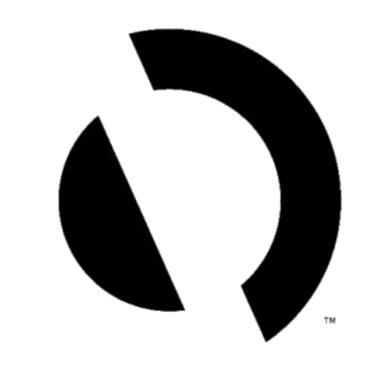
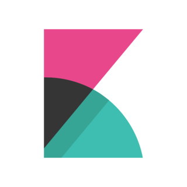
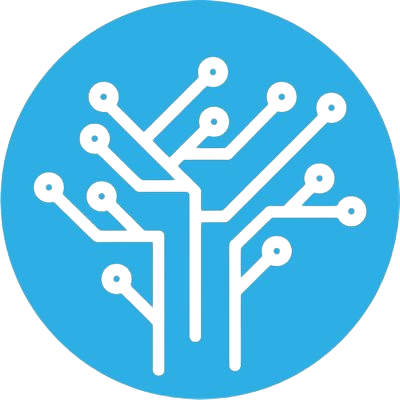

<div align="center">
    
</div>

<h1 align="center">The open-source alert management and AIOps platform</h1>

<div align="center">Single pane of glass, filtering, bi-directional integrations, alert correlation, workflows, enrichment, dashboards.
</br>AI correlation and AI summarization are under the limited preview (<a href="https://www.keephq.dev/meet-keep">Book a Demo</a>)</div>
</br>

<div align="center">
    <a href="https://slack.keephq.dev">
      </a>
    <a href="https://codecov.io/gh/keephq/keep" >
        
    </a>
</div>
<p align="center">
    <a href="#why-keep">Why Keep?</a>
    ·
    <a href="#getting-started">Getting started</a>
    ·
    <a href="#supported-providers">Supported tools and integrations</a>
    ·
    <a href="https://docs.keephq.dev">Docs</a>
    ·
    <a href="https://platform.keephq.dev">Try it out</a>
    ·
    <a href="https://keephq.dev">Website</a>
    ·
    <a href="https://github.com/keephq/keep/issues/new?assignees=&labels=bug&template=bug_report.md&title=">Report Bug</a>
    ·
    <a href="https://slack.keephq.dev">Slack Community</a>
</p>

## How does it work?

1. **Connect your tools**: Connect everything from monitoring platforms to databases and ticketing systems.
<div align="center">

| Connect providers                           | Receive alerts                        |
| ------------------------------------------- | ------------------------------------- |
|  |  |

</div>

2. **Set up Workflows**: Initiate automated workflows in response to alerts or based on custom intervals.

<div align="center">

| Create and upload workflows               |
| ----------------------------------------- |
|  |

</div>

3. **Operational efficiency**: Automate your alert handling to focus your team's efforts on what really matters.

## Why Keep?

1. **Centralized dashboard**: Manage all your alerts across different platforms in a single interface.
2. **Noise reduction**: Deduplicate and correlate alerts to reduce alert fatigue.
3. **Automation**: Trigger workflows for alert enrichment and response.
4. **Developer-first**: Keep is API-first and lets you manage your workflows as code.
5. **Works with every tool**: Plenty of [supported providers](#supported-providers) and more to come.

## Workflows

The easiest way of thinking about Workflow in Keep is GitHub Actions. At its core, a Workflow in Keep is a declarative YAML file, composed of triggers, steps, and actions and serves to manage, enrich, and automate responses to alerts:

```yaml
workflow:
  id: most-basic-keep-workflow
  description: send a slack message when a cloudwatch alarm is triggered
  # workflow triggers - supports alerts, interval, and manual triggers
  triggers:
    - type: alert
      filters:
        - key: source
          value: cloudwatch
    - type: manual
  # list of steps that can add context to your alert
  steps:
    - name: enrich-alert-with-more-data-from-a-database
      provider:
        type: bigquery
        config: "{{ providers.bigquery-prod }}"
        with:
          query: "SELECT customer_id, customer_type as date FROM `customers_prod` LIMIT 1"
  # list of actions that can automate response and do things with your alert
  actions:
    - name: trigger-slack
      provider:
        type: slack
        config: " {{ providers.slack-prod }} "
        with:
          message: "Got alarm from aws cloudwatch! {{ alert.name }}"
```

Workflow triggers can either be executed manually when an alert is activated or run at predefined intervals. More examples can be found [here](https://github.com/keephq/keep/tree/main/examples/workflows).

## Supported Integrations

### Observability Tools

<table>
<tr>
    <td align="center" width="150">
        <a href="https://docs.keephq.dev/providers/documentation/appdynamics-provider" target="_blank">
            <br/>
            AppDynamics
        </a>
    </td>
    <td align="center" width="150">
        <a href="https://docs.keephq.dev/providers/documentation/axiom-provider" target="_blank">
            <br/>
            Axiom
        </a>
    </td>
    <td align="center" width="150">
        <a href="https://docs.keephq.dev/providers/documentation/azuremonitoring-provider" target="_blank">
            <br/>
            Azure Monitoring
        </a>
    </td>
    <td align="center" width="150">
        <a href="https://docs.keephq.dev/providers/documentation/centreon-provider" target="_blank">
            <br/>
            Centreon
        </a>
    </td>
    <td align="center" width="150">
        <a href="https://docs.keephq.dev/providers/documentation/checkmk-provider" target="_blank">
            <br/>
            Checkmk
        </a>
    </td>
    <td align="center" width="150">
        <a href="https://docs.keephq.dev/providers/documentation/cilium-provider" target="_blank">
            <br/>
            Cilium
        </a>
    </td>
</tr>
<tr>
    <td align="center" width="150">
        <a href="https://docs.keephq.dev/providers/documentation/cloudwatch-provider" target="_blank">
            <br/>
            CloudWatch
        </a>
    </td>
    <td align="center" width="150">
        <a href="https://docs.keephq.dev/providers/documentation/coralogix-provider" target="_blank">
            <br/>
            Coralogix
        </a>
    </td>
    <td align="center" width="150">
        <a href="https://docs.keephq.dev/providers/documentation/datadog-provider" target="_blank">
            <br/>
            Datadog
        </a>
    </td>
    <td align="center" width="150">
        <a href="https://docs.keephq.dev/providers/documentation/dynatrace-provider" target="_blank">
            <br/>
            Dynatrace
        </a>
    </td>
    <td align="center">
        <a href="https://docs.keephq.dev/providers/documentation/elastic-provider" target="_blank">
            <br/>
            Elastic
        </a>
    </td>
    <td align="center">
        <a href="https://docs.keephq.dev/providers/documentation/gcpmonitoring-provider" target="_blank">
            <br/>
            GCP Monitoring
        </a>
    </td>
  </tr>
  <tr>
    <td align="center" width="150">
        <a href="https://docs.keephq.dev/providers/documentation/grafana-provider" target="_blank">
            <br/>
            Grafana
        </a>
    </td>
    <td align="center" width="150">
        <a href="https://docs.keephq.dev/providers/documentation/graylog-provider" target="_blank">
            <br/>
            Graylog
        </a>
    </td>
    <td align="center" width="150">
        <a href="https://docs.keephq.dev/providers/documentation/kibana-provider" target="_blank">
            <br/>
            Kibana
        </a>
    </td>
    <td align="center" width="150">
        <a href="https://docs.keephq.dev/providers/documentation/netdata-provider" target="_blank">
            <br/>
            Netdata
        </a>
    </td>
    <td align="center" width="150">
        <a href="https://docs.keephq.dev/providers/documentation/new-relic-provider" target="_blank">
            <br/>
            New Relic
        </a>
    </td>
    <td align="center" width="150">
        <a href="https://docs.keephq.dev/providers/documentation/openobserve-provider" target="_blank">
            <br/>
            OpenObserve
        </a>
    </td>
  </tr>
  <tr>
    <td align="center" width="150">
        <a href="https://docs.keephq.dev/providers/documentation/parseable-provider" target="_blank">
            <br/>
            Parseable
        </a>
    </td>
    <td align="center" width="150">
        <a href="https://docs.keephq.dev/providers/documentation/pingdom-provider" target="_blank">
            <br/>
            Pingdom
        </a>
    </td>
    <td align="center" width="150">
        <a href="https://docs.keephq.dev/providers/documentation/prometheus-provider" target="_blank">
            <br/>
            Prometheus
        </a>
    </td>
    <td align="center" width="150">
        <a href="https://docs.keephq.dev/providers/documentation/rollbar-provider" target="_blank">
            <br/>
            Rollbar
        </a>
    </td>
    <td align="center" width="150">
        <a href="https://docs.keephq.dev/providers/documentation/sentry-provider" target="_blank">
            <br/>
            Sentry
        </a>
    </td>
    <td align="center" width="150">
        <a href="https://docs.keephq.dev/providers/documentation/signalfx-provider" target="_blank">
            <br/>
            SignalFX
        </a>
    </td>
</tr>
<tr>
  <td align="center" width="150">
        <a href="https://docs.keephq.dev/providers/documentation/site24x7-provider" target="_blank">
            <br/>
          Site24x7
        </a>
  </td>
  <td align="center" width="150">
        <a href="https://docs.keephq.dev/providers/documentation/splunk-provider" target="_blank">
            <br/>
          Splunk
        </a>
  </td>
  <td align="center" width="150">
        <a href="https://docs.keephq.dev/providers/documentation/statuscake-provider" target="_blank">
            <br/>
          StatusCake
        </a>
  </td>
  <td align="center" width="150">
        <a href="https://docs.keephq.dev/providers/documentation/sumologic-provider" target="_blank">
            <br/>
          SumoLogic
        </a>
  </td>
  <td align="center" width="150">
        <a href="https://docs.keephq.dev/providers/documentation/uptimekuma-provider" target="_blank">
            <br/>
          UptimeKume
        </a>
  </td>
  <td align="center" width="150">
        <a href="https://docs.keephq.dev/providers/documentation/victoriametrics-provider" target="_blank">
            <br/>
          VictoriaMetrics
        </a>
  </td>
</tr>
<tr>
  <td align="center" width="150">
        <a href="https://docs.keephq.dev/providers/documentation/zabbix-provider" target="_blank">
            <br/>
          Zabbix
        </a>
  </td>
</tr>
</table>

### Databases & Data Warehouses

<table>
<tr>
    <td align="center" width="150">
        <a href="https://docs.keephq.dev/providers/documentation/bigquery-provider" target="_blank">
            <br/>
            BigQuery
        </a>
    </td>
    <td align="center" width="150">
        <a href="https://docs.keephq.dev/providers/documentation/clickhouse-provider" target="_blank">
            <br/>
            ClickHouse
        </a>
    </td>
    <td align="center" width="150">
        <a href="https://docs.keephq.dev/providers/documentation/mongodb-provider" target="_blank">
            <br/>
            MongoDB
        </a>
    </td>
    <td align="center" width="150">
        <a href="https://docs.keephq.dev/providers/documentation/mysql-provider" target="_blank">
            <br/>
            MySQL
        </a>
    </td>
    <td align="center" width="150">
        <a href="https://docs.keephq.dev/providers/documentation/postgres-provider" target="_blank">
            <br/>
            PostgreSQL
        </a>
    </td>
    <td align="center" width="150">
        <a href="https://docs.keephq.dev/providers/documentation/snowflake-provider" target="_blank">
            <br/>
            Snowflake
        </a>
    </td>
</tr>
</table>

### Communication Platforms

<table>
<tr>
    <td align="center" width="150">
        <a href="https://docs.keephq.dev/providers/documentation/discord" target="_blank">
            <br/>
            Discord
        </a>
    </td>
    <td align="center" width="150">
        <a href="https://docs.keephq.dev/providers/documentation/google_chat-provider" target="_blank">
            <br/>
            Google Chat
        </a>
    </td>
    <td align="center" width="150">
        <a href="https://docs.keephq.dev/providers/documentation/mailchimp-provider" target="_blank">
            <br/>
            Mailchimp
        </a>
    </td>
    <td align="center" width="150">
        <a href="https://docs.keephq.dev/providers/documentation/mailgun-provider" target="_blank">
            <br/>
            Mailgun
        </a>
    </td>
    <td align="center" width="150">
        <a href="https://docs.keephq.dev/providers/documentation/mattermost-provider" target="_blank">
            <br/>
            Mattermost
        </a>
    </td>
    <td align="center" width="150">
        <a href="https://docs.keephq.dev/providers/documentation/ntfy-provider" target="_blank">
            <br/>
            Ntfy.sh
        </a>
    </td>
</tr>
<tr>
  <td align="center" width="150">
        <a href="https://docs.keephq.dev/providers/documentation/pushover-provider" target="_blank">
            <br/>
            Pushover
        </a>
  </td>
  <td align="center" width="150">
        <a href="https://docs.keephq.dev/providers/documentation/resend-provider" target="_blank">
            <br/>
            Resend
        </a>
  </td>
  <td align="center" width="150">
      <a href="https://docs.keephq.dev/providers/documentation/sendgrid-provider" target="_blank">
          <br/>
          SendGrid
      </a>
  </td>
  <td align="center" width="150">
      <a href="https://docs.keephq.dev/providers/documentation/slack-provider" target="_blank">
          <br/>
          Slack
      </a>
  </td>
  <td align="center" width="150">
      <a href="https://docs.keephq.dev/providers/documentation/smtp-provider" target="_blank">
          <br/>
          SMTP
      </a>
  </td>
  <td align="center" width="150">
      <a href="https://docs.keephq.dev/providers/documentation/teams-provider" target="_blank">
          <br/>
          Teams
      </a>
  </td>
</tr>
<tr>
  <td align="center" width="150">
      <a href="https://docs.keephq.dev/providers/documentation/telegram-provider" target="_blank">
          <br/>
          Telegram
      </a>
  </td>
  <td align="center" width="150">
      <a href="https://docs.keephq.dev/providers/documentation/twilio-provider" target="_blank">
          <br/>
          Twilio
      </a>
  </td>
</tr>
</table>

### Incident Management

<table>
  <tr>
      <td align="center" width="150">
          <a href="https://docs.keephq.dev/providers/documentation/grafana_incident-provider" target="_blank">
              <br/>
              Grafana Incident
          </a>
      </td>
      <td align="center" width="150">
          <a href="https://docs.keephq.dev/providers/documentation/grafana_oncall-provider" target="_blank">
              <br/>
              Grafana OnCall
          </a>
      </td>
      <td align="center" width="150">
          <a href="https://docs.keephq.dev/providers/documentation/ilert-provider" target="_blank">
              <br/>
              Ilert
          </a>
      </td>
      <td align="center" width="150">
          <a href="https://docs.keephq.dev/providers/documentation/incidentio-provider" target="_blank">
              <br/>
              Incident.io
          </a>
      </td>
      <td align="center" width="150">
          <a href="https://docs.keephq.dev/providers/documentation/incidentmanager-provider" target="_blank">
              <br/>
              AWS Incident Manager
          </a>
      </td>
      <td align="center" width="150">
          <a href="https://docs.keephq.dev/providers/documentation/opsgenie-provider" target="_blank">
              <br/>
              OpsGenie
          </a>
      </td>
  </tr>
    <tr>
      <td align="center" width="150">
          <a href="https://docs.keephq.dev/providers/documentation/pagerduty-provider" target="_blank">
              <br/>
              PagerDuty
          </a>
      </td>
      <td align="center" width="150">
          <a href="https://docs.keephq.dev/providers/documentation/pagertree-provider" target="_blank">
              <br/>
              Pagertree
          </a>
      </td>
      <td align="center" width="150">
          <a href="https://docs.keephq.dev/providers/documentation/signl4-provider" target="_blank">
              <br/>
              SINGL4
          </a>
      </td>
      <td align="center" width="150">
          <a href="https://docs.keephq.dev/providers/documentation/squadcast-provider" target="_blank">
              <br/>
              Squadcast
          </a>
      </td>
      <td align="center" width="150">
          <a href="https://docs.keephq.dev/providers/documentation/zenduty-provider" target="_blank">
              <br/>
              Zenduty
          </a>
      </td>
  </tr>
</table>

### Ticketing Tools

<table>
<tr>
    <td align="center" width="150">
        <a href="https://docs.keephq.dev/providers/documentation/github-provider" target="_blank">
            <br/>
            GitHub
        </a>
    </td>
    <td align="center" width="150">
        <a href="https://docs.keephq.dev/providers/documentation/gitlab-provider" target="_blank">
            <br/>
            GitLab
        </a>
    </td>
    <td align="center" width="150">
        <a href="https://docs.keephq.dev/providers/documentation/jira-provider" target="_blank">
            <br/>
            Jira
        </a>
    </td>
    <td align="center" width="150">
        <a href="https://docs.keephq.dev/providers/documentation/linear_provider" target="_blank">
            <br/>
            Linear
        </a>
    </td>
    <td align="center" width="150">
        <a href="https://docs.keephq.dev/providers/documentation/linearb-provider" target="_blank">
            <br/>
            LinearB
        </a>
    </td>
    <td align="center" width="150">
        <a href="https://docs.keephq.dev/providers/documentation/microsoft-planner-provider" target="_blank">
            <br/>
            Microsoft Planner
        </a>
    </td>
</tr>
<tr>
  <td align="center" width="150">
        <a href="https://docs.keephq.dev/providers/documentation/redmine-provider" target="_blank">
            <br/>
            Redmine
        </a>
  </td>
  <td align="center" width="150">
      <a href="https://docs.keephq.dev/providers/documentation/service-now-provider" target="_blank">
          <br/>
          ServiceNow
      </a>
  </td>
  <td align="center" width="150">
      <a href="https://docs.keephq.dev/providers/documentation/trello-provider" target="_blank">
          <br/>
          Trello
      </a>
  </td>
</tr>
</table>

### Container Orchecstration Platforms

<table>
<tr>
    <td align="center" width="150">
        <a href="https://docs.keephq.dev/providers/documentation/aks-provider" target="_blank">
            <br/>
            Azure AKS
        </a>
    </td>
    <td align="center" width="150">
        <a href="https://docs.keephq.dev/providers/documentation/gke-provider" target="_blank">
            <br/>
            GKE
        </a>
    </td>
    <td align="center" width="150">
        <a href="https://docs.keephq.dev/providers/documentation/kubernetes-provider" target="_blank">
            <br/>
            Kubernetes
        </a>
    </td>
    <td align="center" width="150">
        <a href="https://docs.keephq.dev/providers/documentation/openshift-provider" target="_blank">
            <br/>
            OpenShift
        </a>
    </td>
</tr>
</table>

### Data Enrichment

<table>
<tr>
    <td align="center" width="150">
        <a href="https://docs.keephq.dev/providers/documentation/openai-provider" target="_blank">
            <br/>
            OpenAI
        </a>
    </td>
    <td align="center" width="150">
        <a href="https://docs.keephq.dev/providers/documentation/python-provider" target="_blank">
            <br/>
            Python
        </a>
    </td>
    <td align="center" width="150">
        <a href="https://docs.keephq.dev/providers/documentation/quickchart-provider" target="_blank">
            <br/>
            QuickChart
        </a>
    </td>
    <td align="center" width="150">
        <a href="https://docs.keephq.dev/providers/documentation/ssh-provider" target="_blank">
            <br/>
            SSH
        </a>
    </td>
    <td align="center" width="150">
        <a href="https://docs.keephq.dev/providers/documentation/webhook-provider" target="_blank">
            <br/>
            Webhook
        </a>
    </td>
</tr>
</table>

> Missing a provider? [Submit a new provider request](https://github.com/keephq/keep/issues/new?assignees=&labels=provider&projects=&template=new_provider_request.md&title=) and we'll add it quickly!

## Getting Started

### Overview

Keep composed of three main components:

1. [Keep UI](https://github.com/keephq/keep/tree/main/keep-ui) - A NextJS app to connect your providers, centralize alerts and create the workflows.
2. [Keep Backend](https://github.com/keephq/keep/tree/main/keep) - A FastAPI server that implements the business logic behind Keep, including integrating with the tools, working with alerts and scheduling and running the workflows.
3. [Keep CLI](https://github.com/keephq/keep/blob/main/keep/cli/cli.py) - A CLI that lets you control and manage Keep via CLI.

> **Disclaimer**: we use [PostHog](https://posthog.com/faq) to collect anonymous telemetries to better learn how users use Keep (masked screen recordings for CLI commands)
> To turn PostHog off, set the `POSTHOG_DISABLED=true` environment variable and remove the `NEXT_PUBLIC_POSTHOG_KEY` environment variable.

### Quickstart

#### Spinning up Keep with docker-compose

The easiest way to start with Keep is to run it via docker-compose:

```shell
curl https://raw.githubusercontent.com/keephq/keep/main/start.sh | sh
```

The UI is now available at http://localhost:3000 and the backend is available at http://localhost:8080.

#### Spinning up Keep with Helm on Kubernetes/Openshift

To install Keep to your Kubernetes ease free with Helm, run the following commands:

```shell
helm repo add keephq https://keephq.github.io/helm-charts
helm pull keephq/keep
helm install keep keephq/keep
```

More information about the Helm chart can be found [here](https://github.com/keephq/helm-charts).

#### Local development

You can also start Keep within your favorite IDE, e.g. [VSCode](https://docs.keephq.dev/development/getting-started#vscode)

#### Wanna get Keep up and running in production? Go through our detailed [development guide](https://docs.keephq.dev/development)

## 🫵 Keepers

### Top Contributors

A special thanks to our top contributors who help us make Keep great. You are more than awesome!

- [Furkan](https://github.com/pehlicd)
- [Asharon](https://github.com/asharonbaltazar)

Want to become a top contributor? Join our Slack and DM Tal, Shahar, or Furkan.

### Contributors

Thank you for contributing and continuously making <b>Keep</b> better, <b>you're awesome</b> 🫶 

<a href="https://github.com/keephq/keep/graphs/contributors">
  
</a>
