<div align="center">
    
</div>

<h1 align="center">The open-source AIOps and alert management platform</h1>

</br>

<div align="center">Single pane of glass, alert deduplication, enrichment, filtering and correlation, bi-directional integrations, workflows, dashboards.
</br>
</div>

<div align="center">
    <a href='http://makeapullrequest.com'>
      </a>
    <a href="https://slack.keephq.dev">
      </a>
    <a href="https://github.com/keephq/keep/commits/main">
      </a>
    <a href="https://codecov.io/gh/keephq/keep" >
        
    </a>
</div>

<p align="center">
    <a href="https://docs.keephq.dev">Docs</a>
    ·
    <a href="https://platform.keephq.dev">Try it out</a>
    ·
    <a href="https://github.com/keephq/keep/issues/new?assignees=&labels=bug&template=bug_report.md&title=">Report Bug</a>
    ·
    <a href="https://www.keephq.dev/meet-keep">Book a Demo</a>
    ·
    <a href="https://www.keephq.dev">Website</a>
</p>

<div style="width: 100%; max-width: 800px; margin: 0 auto;">
    
</div>

<h1 align="center"></h1>

- 🔍 **Single pane of glass** - Best-in-class customizable UI for all your alerts and incidents
- 🛠️ **Swiss Army Knife for alerts** - Deduplication, correlation, filtering and enrichment
- 🔄 **Deep integrations** - Bi-directional syncs with monitoring tools, customizable workflows
- ⚡ **[Automation](#workflows)** - GitHub Actions for your monitoring tools
- 🤖 **AIOps 2.0** - AI-powered correlation and summarization

</br>

> See full [platform documentation](https://docs.keephq.dev).

</br>

## Supported Integrations

> View the full list in our [documentation](https://docs.keephq.dev/providers/documentation)

> Missing a provider? [Submit a new provider request](https://github.com/keephq/keep/issues/new?assignees=&labels=provider&projects=&template=new_provider_request.md&title=) and we'll add it quickly!

### Observability Tools

<table>
<tr>
    <td align="center" width="150">
        <a href="https://docs.keephq.dev/providers/documentation/amazonsqs-provider" target="_blank">
            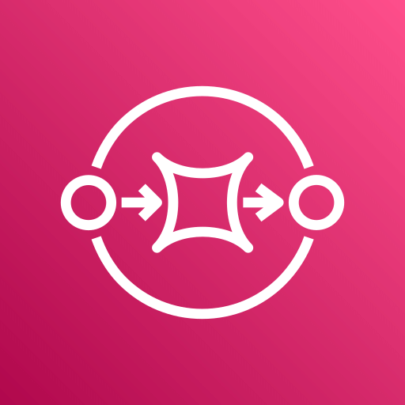<br/>
            Amazon SQS
        </a>
    </td>
    <td align="center" width="150">
        <a href="https://docs.keephq.dev/providers/documentation/appdynamics-provider" target="_blank">
            <br/>
            AppDynamics
        </a>
    </td>
    <td align="center" width="150">
        <a href="https://docs.keephq.dev/providers/documentation/axiom-provider" target="_blank">
            <br/>
            Axiom
        </a>
    </td>
    <td align="center" width="150">
        <a href="https://docs.keephq.dev/providers/documentation/azuremonitoring-provider" target="_blank">
            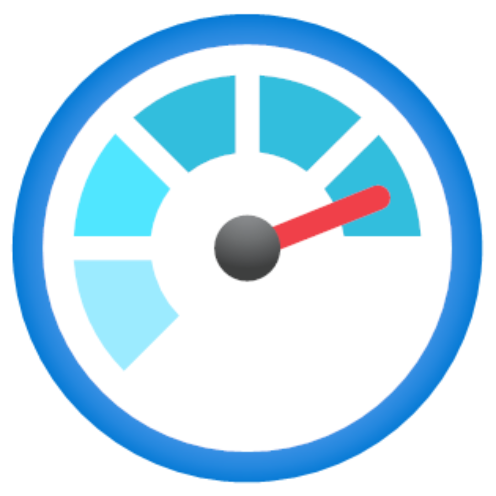<br/>
            Azure Monitoring
        </a>
    </td>
    <td align="center" width="150">
        <a href="https://docs.keephq.dev/providers/documentation/centreon-provider" target="_blank">
            <br/>
            Centreon
        </a>
    </td>
    <td align="center" width="150">
        <a href="https://docs.keephq.dev/providers/documentation/checkmk-provider" target="_blank">
            <br/>
            Checkmk
        </a>
    </td>
</tr>
<tr>
    <td align="center" width="150">
        <a href="https://docs.keephq.dev/providers/documentation/cilium-provider" target="_blank">
            <br/>
            Cilium
        </a>
    </td>
    <td align="center" width="150">
        <a href="https://docs.keephq.dev/providers/documentation/cloudwatch-provider" target="_blank">
            <br/>
            CloudWatch
        </a>
    </td>
    <td align="center" width="150">
        <a href="https://docs.keephq.dev/providers/documentation/coralogix-provider" target="_blank">
            <br/>
            Coralogix
        </a>
    </td>
    <td align="center" width="150">
        <a href="https://docs.keephq.dev/providers/documentation/datadog-provider" target="_blank">
            <br/>
            Datadog
        </a>
    </td>
    <td align="center" width="150">
        <a href="https://docs.keephq.dev/providers/documentation/dynatrace-provider" target="_blank">
            <br/>
            Dynatrace
        </a>
    </td>
    <td align="center">
        <a href="https://docs.keephq.dev/providers/documentation/elastic-provider" target="_blank">
            <br/>
            Elastic
        </a>
    </td>
  </tr>
  <tr>
    <td align="center">
        <a href="https://docs.keephq.dev/providers/documentation/gcpmonitoring-provider" target="_blank">
            <br/>
            GCP Monitoring
        </a>
    </td>
    <td align="center" width="150">
        <a href="https://docs.keephq.dev/providers/documentation/grafana-provider" target="_blank">
            <br/>
            Grafana
        </a>
    </td>
    <td align="center" width="150">
        <a href="https://docs.keephq.dev/providers/documentation/graylog-provider" target="_blank">
            <br/>
            Graylog
        </a>
    </td>
    <td align="center" width="150">
        <a href="https://docs.keephq.dev/providers/documentation/kibana-provider" target="_blank">
            <br/>
            Kibana
        </a>
    </td>
    <td align="center" width="150">
        <a href="https://docs.keephq.dev/providers/documentation/netdata-provider" target="_blank">
            <br/>
            Netdata
        </a>
    </td>
    <td align="center" width="150">
        <a href="https://docs.keephq.dev/providers/documentation/new-relic-provider" target="_blank">
            <br/>
            New Relic
        </a>
    </td>
  </tr>
  <tr>
    <td align="center" width="150">
        <a href="https://docs.keephq.dev/providers/documentation/parseable-provider" target="_blank">
            <br/>
            Parseable
        </a>
    </td>
    <td align="center" width="150">
        <a href="https://docs.keephq.dev/providers/documentation/pingdom-provider" target="_blank">
            <br/>
            Pingdom
        </a>
    </td>
    <td align="center" width="150">
        <a href="https://docs.keephq.dev/providers/documentation/prometheus-provider" target="_blank">
            <br/>
            Prometheus
        </a>
    </td>
    <td align="center" width="150">
        <a href="https://docs.keephq.dev/providers/documentation/rollbar-provider" target="_blank">
            <br/>
            Rollbar
        </a>
    </td>
    <td align="center" width="150">
        <a href="https://docs.keephq.dev/providers/documentation/sentry-provider" target="_blank">
            <br/>
            Sentry
        </a>
    </td>
    <td align="center" width="150">
        <a href="https://docs.keephq.dev/providers/documentation/signalfx-provider" target="_blank">
            <br/>
            SignalFX
        </a>
    </td>
</tr>
<tr>
  <td align="center" width="150">
        <a href="https://docs.keephq.dev/providers/documentation/openobserve-provider" target="_blank">
            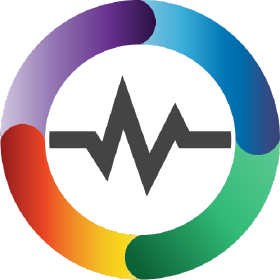<br/>
            OpenObserve
        </a>
    </td>
  <td align="center" width="150">
        <a href="https://docs.keephq.dev/providers/documentation/site24x7-provider" target="_blank">
            <br/>
          Site24x7
        </a>
  </td>
  <td align="center" width="150">
        <a href="https://docs.keephq.dev/providers/documentation/splunk-provider" target="_blank">
            <br/>
          Splunk
        </a>
  </td>
  <td align="center" width="150">
        <a href="https://docs.keephq.dev/providers/documentation/statuscake-provider" target="_blank">
            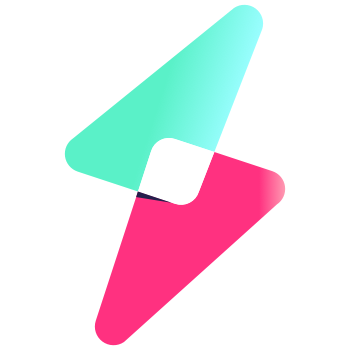<br/>
          StatusCake
        </a>
  </td>
  <td align="center" width="150">
        <a href="https://docs.keephq.dev/providers/documentation/sumologic-provider" target="_blank">
            <br/>
          SumoLogic
        </a>
  </td>
  <td align="center" width="150">
        <a href="https://docs.keephq.dev/providers/documentation/uptimekuma-provider" target="_blank">
            <br/>
          UptimeKuma
        </a>
  </td>
</tr>
<tr>
  <td align="center" width="150">
        <a href="https://docs.keephq.dev/providers/documentation/victoriametrics-provider" target="_blank">
            <br/>
          VictoriaMetrics
        </a>
  </td>
  <td align="center" width="150">
        <a href="https://docs.keephq.dev/providers/documentation/wazuh-provider" target="_blank">
            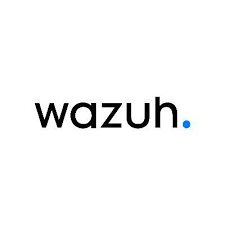<br/>
          Wazuh
        </a>
  </td>
  <td align="center" width="150">
        <a href="https://docs.keephq.dev/providers/documentation/zabbix-provider" target="_blank">
            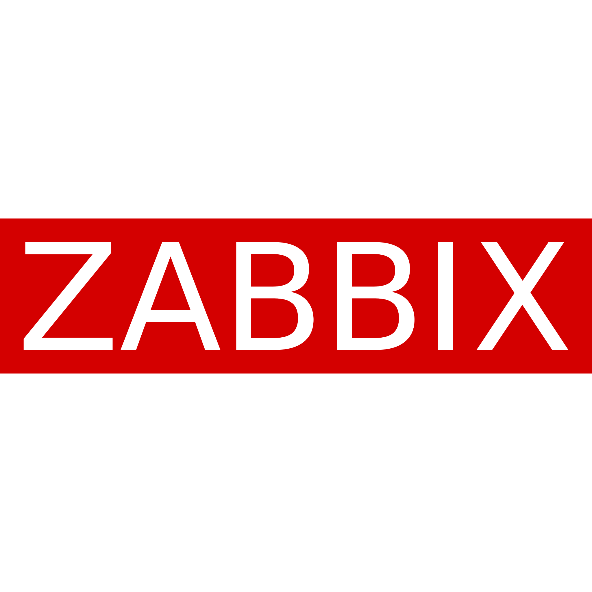<br/>
          Zabbix
        </a>
  </td>
</tr>
</table>

### Databases & Data Warehouses

<table>
<tr>
    <td align="center" width="150">
        <a href="https://docs.keephq.dev/providers/documentation/bigquery-provider" target="_blank">
            <br/>
            BigQuery
        </a>
    </td>
    <td align="center" width="150">
        <a href="https://docs.keephq.dev/providers/documentation/clickhouse-provider" target="_blank">
            <br/>
            ClickHouse
        </a>
    </td>
    <td align="center" width="150">
        <a href="https://docs.keephq.dev/providers/documentation/mongodb-provider" target="_blank">
            <br/>
            MongoDB
        </a>
    </td>
    <td align="center" width="150">
        <a href="https://docs.keephq.dev/providers/documentation/mysql-provider" target="_blank">
            <br/>
            MySQL
        </a>
    </td>
    <td align="center" width="150">
        <a href="https://docs.keephq.dev/providers/documentation/postgres-provider" target="_blank">
            <br/>
            PostgreSQL
        </a>
    </td>
    <td align="center" width="150">
        <a href="https://docs.keephq.dev/providers/documentation/snowflake-provider" target="_blank">
            <br/>
            Snowflake
        </a>
    </td>
</tr>
</table>

### Communication Platforms

<table>
<tr>
    <td align="center" width="150">
        <a href="https://docs.keephq.dev/providers/documentation/discord" target="_blank">
            <br/>
            Discord
        </a>
    </td>
    <td align="center" width="150">
        <a href="https://docs.keephq.dev/providers/documentation/google_chat-provider" target="_blank">
            <br/>
            Google Chat
        </a>
    </td>
    <td align="center" width="150">
        <a href="https://docs.keephq.dev/providers/documentation/mailchimp-provider" target="_blank">
            <br/>
            Mailchimp
        </a>
    </td>
    <td align="center" width="150">
        <a href="https://docs.keephq.dev/providers/documentation/mailgun-provider" target="_blank">
            <br/>
            Mailgun
        </a>
    </td>
    <td align="center" width="150">
        <a href="https://docs.keephq.dev/providers/documentation/mattermost-provider" target="_blank">
            <br/>
            Mattermost
        </a>
    </td>
    <td align="center" width="150">
        <a href="https://docs.keephq.dev/providers/documentation/ntfy-provider" target="_blank">
            <br/>
            Ntfy.sh
        </a>
    </td>
</tr>
<tr>
  <td align="center" width="150">
        <a href="https://docs.keephq.dev/providers/documentation/pushover-provider" target="_blank">
            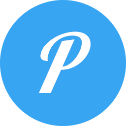<br/>
            Pushover
        </a>
  </td>
  <td align="center" width="150">
        <a href="https://docs.keephq.dev/providers/documentation/resend-provider" target="_blank">
            <br/>
            Resend
        </a>
  </td>
  <td align="center" width="150">
      <a href="https://docs.keephq.dev/providers/documentation/sendgrid-provider" target="_blank">
          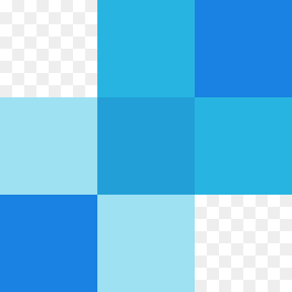<br/>
          SendGrid
      </a>
  </td>
  <td align="center" width="150">
      <a href="https://docs.keephq.dev/providers/documentation/slack-provider" target="_blank">
          <br/>
          Slack
      </a>
  </td>
  <td align="center" width="150">
      <a href="https://docs.keephq.dev/providers/documentation/smtp-provider" target="_blank">
          <br/>
          SMTP
      </a>
  </td>
  <td align="center" width="150">
      <a href="https://docs.keephq.dev/providers/documentation/teams-provider" target="_blank">
          <br/>
          Teams
      </a>
  </td>
</tr>
<tr>
  <td align="center" width="150">
      <a href="https://docs.keephq.dev/providers/documentation/telegram-provider" target="_blank">
          <br/>
          Telegram
      </a>
  </td>
  <td align="center" width="150">
      <a href="https://docs.keephq.dev/providers/documentation/twilio-provider" target="_blank">
          <br/>
          Twilio
      </a>
  </td>
</tr>
</table>

### Incident Management

<table>
  <tr>
      <td align="center" width="150">
          <a href="https://docs.keephq.dev/providers/documentation/grafana_incident-provider" target="_blank">
              <br/>
              Grafana Incident
          </a>
      </td>
      <td align="center" width="150">
          <a href="https://docs.keephq.dev/providers/documentation/grafana_oncall-provider" target="_blank">
              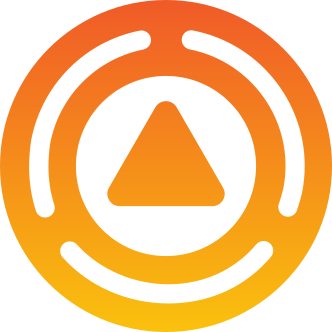<br/>
              Grafana OnCall
          </a>
      </td>
      <td align="center" width="150">
          <a href="https://docs.keephq.dev/providers/documentation/ilert-provider" target="_blank">
              <br/>
              Ilert
          </a>
      </td>
      <td align="center" width="150">
          <a href="https://docs.keephq.dev/providers/documentation/incidentio-provider" target="_blank">
              <br/>
              Incident.io
          </a>
      </td>
      <td align="center" width="150">
          <a href="https://docs.keephq.dev/providers/documentation/incidentmanager-provider" target="_blank">
              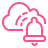<br/>
              AWS Incident Manager
          </a>
      </td>
      <td align="center" width="150">
          <a href="https://docs.keephq.dev/providers/documentation/opsgenie-provider" target="_blank">
              <br/>
              OpsGenie
          </a>
      </td>
  </tr>
    <tr>
      <td align="center" width="150">
          <a href="https://docs.keephq.dev/providers/documentation/pagerduty-provider" target="_blank">
              <br/>
              PagerDuty
          </a>
      </td>
      <td align="center" width="150">
          <a href="https://docs.keephq.dev/providers/documentation/pagertree-provider" target="_blank">
              <br/>
              Pagertree
          </a>
      </td>
      <td align="center" width="150">
          <a href="https://docs.keephq.dev/providers/documentation/signl4-provider" target="_blank">
              <br/>
              SINGL4
          </a>
      </td>
      <td align="center" width="150">
          <a href="https://docs.keephq.dev/providers/documentation/squadcast-provider" target="_blank">
              <br/>
              Squadcast
          </a>
      </td>
      <td align="center" width="150">
          <a href="https://docs.keephq.dev/providers/documentation/zenduty-provider" target="_blank">
              <br/>
              Zenduty
          </a>
      </td>
  </tr>
</table>

### Ticketing Tools

<table>
<tr>
    <td align="center" width="150">
        <a href="https://docs.keephq.dev/providers/documentation/github-provider" target="_blank">
            <br/>
            GitHub
        </a>
    </td>
    <td align="center" width="150">
        <a href="https://docs.keephq.dev/providers/documentation/gitlab-provider" target="_blank">
            <br/>
            GitLab
        </a>
    </td>
    <td align="center" width="150">
        <a href="https://docs.keephq.dev/providers/documentation/jira-provider" target="_blank">
            <br/>
            Jira
        </a>
    </td>
    <td align="center" width="150">
        <a href="https://docs.keephq.dev/providers/documentation/linear_provider" target="_blank">
            <br/>
            Linear
        </a>
    </td>
    <td align="center" width="150">
        <a href="https://docs.keephq.dev/providers/documentation/linearb-provider" target="_blank">
            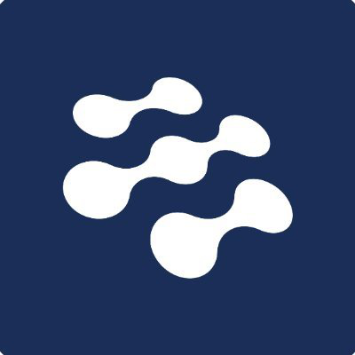<br/>
            LinearB
        </a>
    </td>
    <td align="center" width="150">
        <a href="https://docs.keephq.dev/providers/documentation/microsoft-planner-provider" target="_blank">
            <br/>
            Microsoft Planner
        </a>
    </td>
    <td align="center" width="150">
        <a href="https://docs.keephq.dev/providers/documentation/monday-provider" target="_blank">
            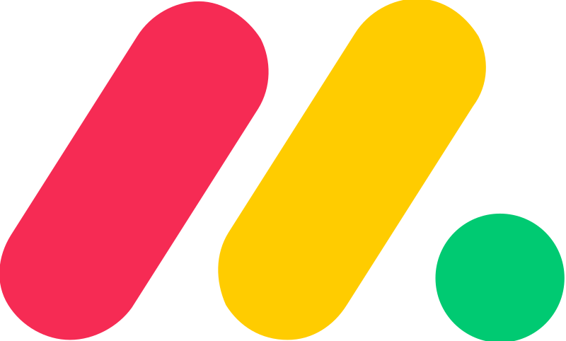<br/>
            Monday
        </a>
    </td>
</tr>
<tr>
  <td align="center" width="150">
        <a href="https://docs.keephq.dev/providers/documentation/redmine-provider" target="_blank">
            <br/>
            Redmine
        </a>
  </td>
  <td align="center" width="150">
      <a href="https://docs.keephq.dev/providers/documentation/service-now-provider" target="_blank">
          <br/>
          ServiceNow
      </a>
  </td>
  <td align="center" width="150">
      <a href="https://docs.keephq.dev/providers/documentation/trello-provider" target="_blank">
          <br/>
          Trello
      </a>
  </td>
</tr>
</table>

### Container Orchecstration Platforms

<table>
<tr>
    <td align="center" width="150">
        <a href="https://docs.keephq.dev/providers/documentation/aks-provider" target="_blank">
            <br/>
            Azure AKS
        </a>
    </td>
    <td align="center" width="150">
        <a href="https://docs.keephq.dev/providers/documentation/argocd-provider" target="_blank">
            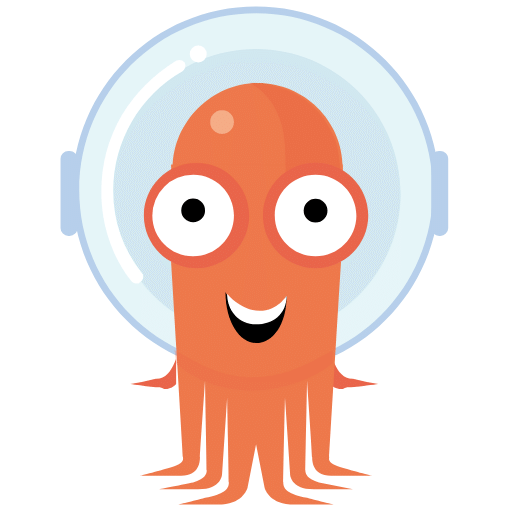<br/>
            ArgoCD
        </a>
    </td>
    <td align="center" width="150">
        <a href="https://docs.keephq.dev/providers/documentation/gke-provider" target="_blank">
            <br/>
            GKE
        </a>
    </td>
    <td align="center" width="150">
        <a href="https://docs.keephq.dev/providers/documentation/kubernetes-provider" target="_blank">
            <br/>
            Kubernetes
        </a>
    </td>
    <td align="center" width="150">
        <a href="https://docs.keephq.dev/providers/documentation/openshift-provider" target="_blank">
            <br/>
            OpenShift
        </a>
    </td>
</tr>
</table>

### Data Enrichment

<table>
<tr>
<td align="center" width="150">
        <a href="https://docs.keephq.dev/providers/documentation/bash-provider" target="_blank">
            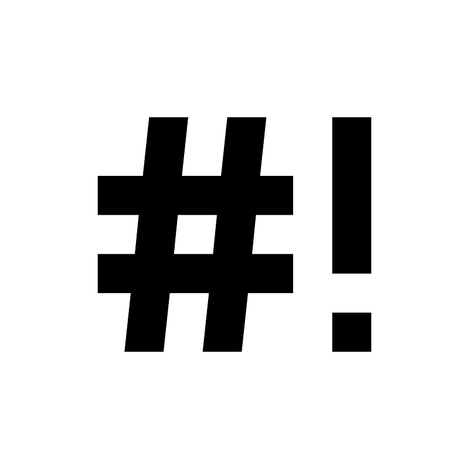<br/>
            Bash
        </a>
    </td>
    <td align="center" width="150">
        <a href="https://docs.keephq.dev/providers/documentation/openai-provider" target="_blank">
            <br/>
            OpenAI
        </a>
    </td>
    <td align="center" width="150">
        <a href="https://docs.keephq.dev/providers/documentation/python-provider" target="_blank">
            <br/>
            Python
        </a>
    </td>
    <td align="center" width="150">
        <a href="https://docs.keephq.dev/providers/documentation/quickchart-provider" target="_blank">
            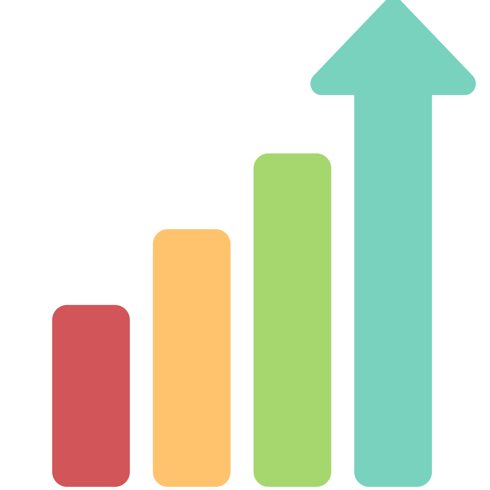<br/>
            QuickChart
        </a>
    </td>
    <td align="center" width="150">
        <a href="https://docs.keephq.dev/providers/documentation/ssh-provider" target="_blank">
            <br/>
            SSH
        </a>
    </td>
    <td align="center" width="150">
        <a href="https://docs.keephq.dev/providers/documentation/webhook-provider" target="_blank">
            <br/>
            Webhook
        </a>
    </td>
</tr>
</table>

## Workflows

Keep is GitHub Actions for your monitoring tools.

A Keep Workflow is a declarative YAML file that automates your alert and incident management. Each workflow consists of:

- **Triggers** - What starts the workflow (alerts, incidents, schedule or manual)
- **Steps** - Read or fetch data (enrichment, context)
- **Actions** - Execute operations (update tickets, send notifications, restart servers)

Here's a simple workflow that creates a Jira ticket for every `critical` alert from `sentry` for `payments` and `api` services.

For more workflows, see [here](https://github.com/keephq/keep/tree/main/examples/workflows).

```yaml
workflow:
  id: sentry-alerts
  description: create ticket alerts for critical alerts from sentry
  triggers:
    - type: alert
      # customize the filter to run only on critical alert from sentry
      filters:
        - key: source
          value: sentry
        - key: severity
          value: critical
        # regex to match specific services
        - key: service
          value: r"(payments|ftp)"
  actions:
    - name: send-slack-message-team-payments
      # if the alert is on the payments service, slack the payments team
      if: "'{{ alert.service }}' == 'payments'"
      provider:
        type: slack
        # control which Slack configuration you want to use
        config: " {{ providers.team-payments-slack }} "
        # customize the alert message with context from {{ alert }} or any other {{ step }}
        with:
          message: |
            "A new alert from Sentry: Alert: {{ alert.name }} - {{ alert.description }}
            {{ alert}}"
    - name: create-jira-ticket-oncall-board
      # control the workflow flow with "if" and "foreach" statements
      if: "'{{ alert.service }}' == 'ftp' and not '{{ alert.ticket_id }}'"
      provider:
        type: jira
        config: " {{ providers.jira }} "
        with:
          board_name: "Oncall Board"
          custom_fields:
            customfield_10201: "Critical"
          issuetype: "Task"
          # customize the summary
          summary: "{{ alert.name }} - {{ alert.description }} (created by Keep)"
          description: |
            "This ticket was created by Keep.
            Please check the alert details below:
            {code:json} {{ alert }} {code}"
          # enrich the alerts with more context. from now on, the alert will be assigned with the ticket id, type and url
          enrich_alert:
            - key: ticket_type
              value: jira
            - key: ticket_id
              value: results.issue.key
            - key: ticket_url
              value: results.ticket_url
```

## Enterprise Ready

- **Developer First** - Modern REST APIs, native SDKs, and comprehensive documentation for seamless integration
- **[Enterprise Security](https://docs.keephq.dev/deployment/authentication/overview)** - Full authentication support (SSO, SAML, OIDC, LDAP) with granular access control (RBAC, ABAC) and team management
- **Flexible Deployment** - Deploy on-premises or in air-gapped environments with cloud-agnostic architecture
- **[Production Scale](https://docs.keephq.dev/deployment/stress-testing)** - High availability, performance-tested infrastructure supporting horizontal scaling for enterprise workloads

## Getting Started

> Need help? Can't find your environment listed? Reach out on Slack and we'll help you quickly.

Keep can run in various environments and configurations. The easiest way to start is with Keep's Docker Compose.

- Running Keep [locally](https://docs.keephq.dev/development/getting-started).
- Running Keep on [Kubernetes](https://docs.keephq.dev/deployment/kubernetes/installation).
- Running Keep with [Docker](https://docs.keephq.dev/deployment/docker).
- Running Keep on [AWS ECS](https://docs.keephq.dev/deployment/ecs).
- Running Keep on [OpenShift](https://docs.keephq.dev/deployment/kubernetes/openshift).

## 🫵 Keepers

### Top Contributors

A special thanks to our top contributors who help us make Keep great. You are more than awesome!

- [Furkan](https://github.com/pehlicd)
- [Asharon](https://github.com/asharonbaltazar)

Want to become a top contributor? Join our Slack and DM Tal, Shahar, or Furkan.

### Contributors

Thank you for contributing and continuously making <b>Keep</b> better, <b>you're awesome</b> 🫶

<a href="https://github.com/keephq/keep/graphs/contributors">
  
</a>
