<div align="center">
    
</div>

<h1 align="center">开源的 AIOps 与告警管理平台</h1>

</br>

<div align="center">统一监控中控、告警去重、丰富、过滤与关联、双向集成、工作流、仪表盘。
</br>
</div>

<div align="center">
    <a href='http://makeapullrequest.com'>
      </a>
    <a href="https://slack.keephq.dev">
      </a>
    <a href="https://github.com/keephq/keep/commits/main">
      </a>
    <a href="https://codecov.io/gh/keephq/keep" >
        
    </a>
</div>

<p align="center">
    <a href="https://docs.keephq.dev">Docs</a>
    ·
    <a href="https://platform.keephq.dev">Try it out</a>
    ·
    <a href="https://github.com/keephq/keep/issues/new?assignees=&labels=bug&template=bug_report.md&title=">Report Bug</a>
    ·
    <a href="https://www.keephq.dev/meet-keep">Book a Demo</a>
    ·
    <a href="https://www.keephq.dev">Website</a>
</p>

<div style="width: 100%; max-width: 800px; margin: 0 auto;">
    
</div>

<h1 align="center"></h1>

- 🔍 **统一视图** - 用于所有告警和事件的最佳可定制界面
- 🛠️ **告警多功能助手** - 去重、关联、过滤与丰富
- 🔄 **深度集成** - 与监控工具双向同步，并支持自定义工作流
- ⚡ **[自动化](#工作流)** - 为你的监控工具提供 GitHub Actions
- 🤖 **AIOps 2.0** - AI 驱动的关联与摘要

</br>

> 查看完整的 [平台文档](https://docs.keephq.dev)。

</br>

## 支持的集成

> 在我们的 [文档](https://docs.keephq.dev/providers/documentation) 中查看完整列表

> 缺少某个提供者？[提交新的提供者申请](https://github.com/keephq/keep/issues/new?assignees=&labels=provider&projects=&template=new_provider_request.md&title=)，我们会尽快添加！

### 用于丰富、关联与事件上下文的 AI 后端

<table>
<tr>
    <td align="center" width="150">
        <a href="https://docs.keephq.dev/providers/documentation/anthropic-provider" target="_blank">
            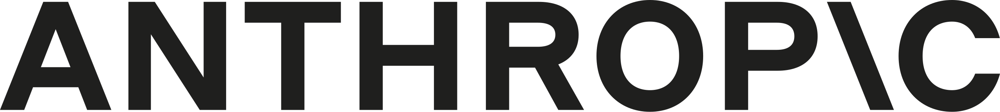<br/>
            Anthropic
        </a>
    </td>
    <td align="center" width="150">
        <a href="https://docs.keephq.dev/providers/documentation/openai-provider" target="_blank">
            <br/>
            OpenAI
        </a>
    </td>
    <td align="center" width="150">
        <a href="https://docs.keephq.dev/providers/documentation/deepseek-provider" target="_blank">
            <br/>
            DeepSeek
        </a>
    </td>
    <td align="center" width="150">
        <a href="https://docs.keephq.dev/providers/documentation/ollama-provider" target="_blank">
            <br/>
            Ollama
        </a>
    </td>
    <td align="center" width="150">
        <a href="https://docs.keephq.dev/providers/documentation/llamacpp-provider" target="_blank">
            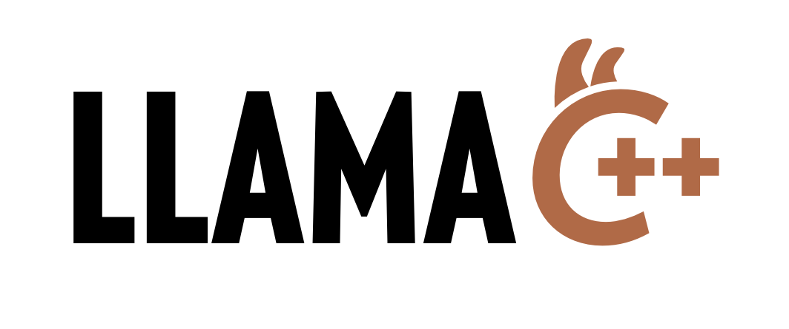<br/>
            LlamaCPP
        </a>
    </td>
    <td align="center" width="150">
        <a href="https://docs.keephq.dev/providers/documentation/grok-provider" target="_blank">
            <br/>
            Grok
        </a>
    </td>
</tr>
<tr>
    <td align="center" width="150">
        <a href="https://docs.keephq.dev/providers/documentation/gemini-provider" target="_blank">
            <br/>
            Gemini
        </a>
    </td>
</tr>
</table>

### 可观测性工具

<table>
<tr>
    <td align="center" width="150">
        <a href="https://docs.keephq.dev/providers/documentation/appdynamics-provider" target="_blank">
            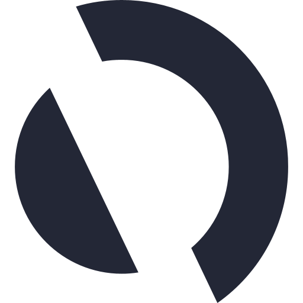<br/>
            AppDynamics
        </a>
    </td>
    <td align="center" width="150">
        <a href="https://docs.keephq.dev/providers/documentation/axiom-provider" target="_blank">
            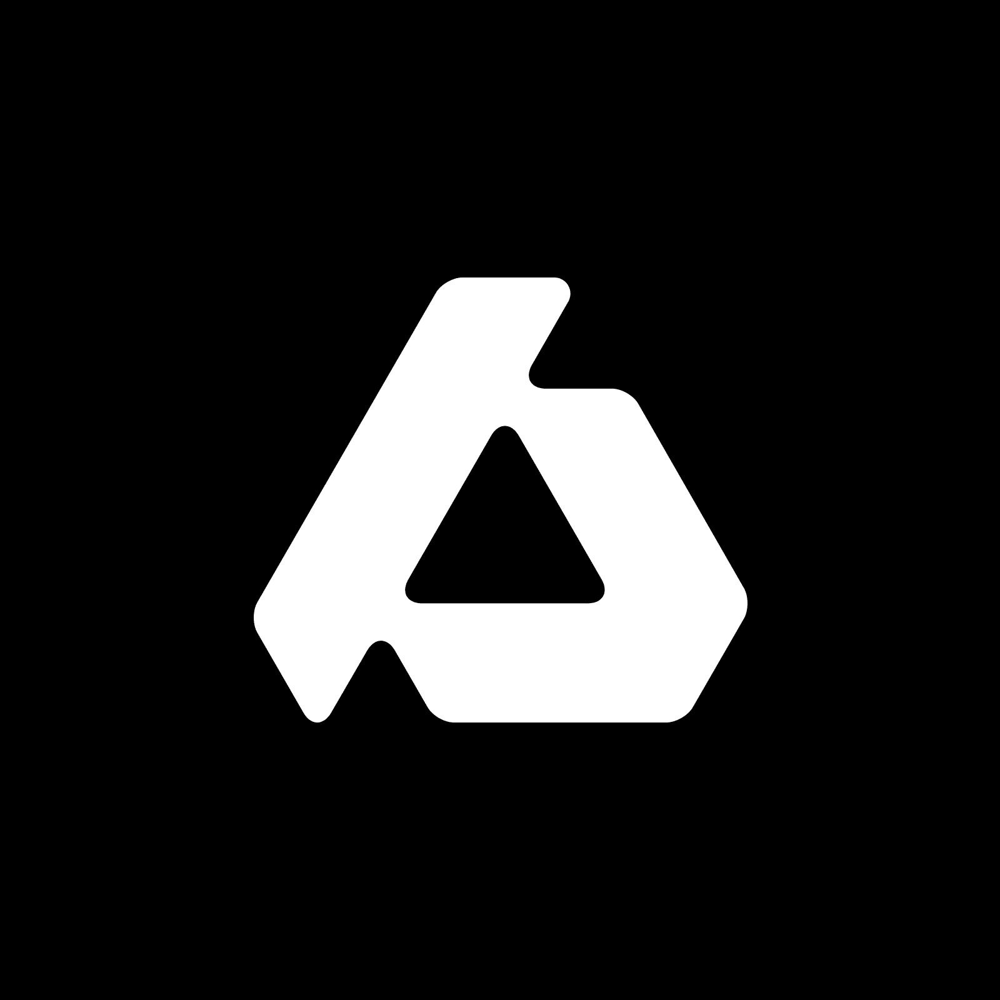<br/>
            Axiom
        </a>
    </td>
    <td align="center" width="150">
        <a href="https://docs.keephq.dev/providers/documentation/azuremonitoring-provider" target="_blank">
            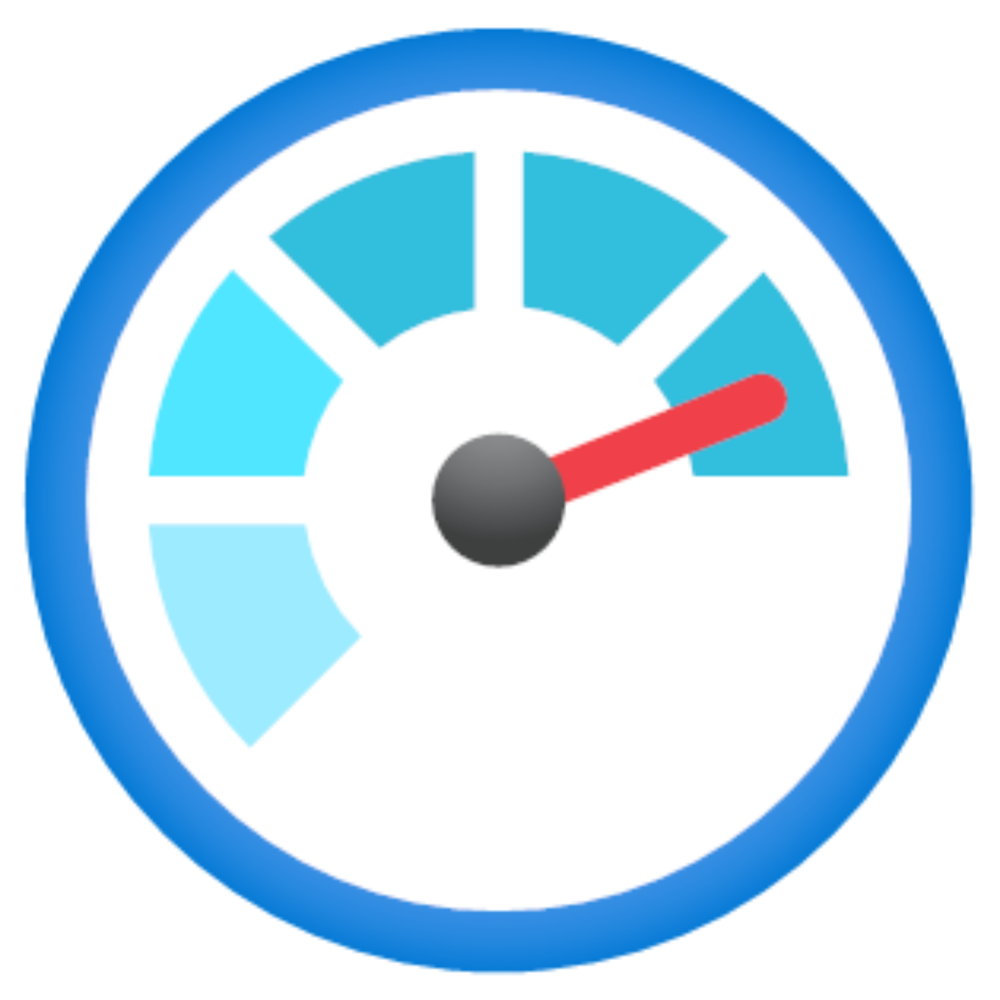<br/>
            Azure Monitoring
        </a>
    </td>
    <td align="center" width="150">
        <a href="https://docs.keephq.dev/providers/documentation/centreon-provider" target="_blank">
            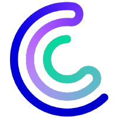<br/>
            Centreon
        </a>
    </td>
    <td align="center" width="150">
        <a href="https://docs.keephq.dev/providers/documentation/checkmk-provider" target="_blank">
            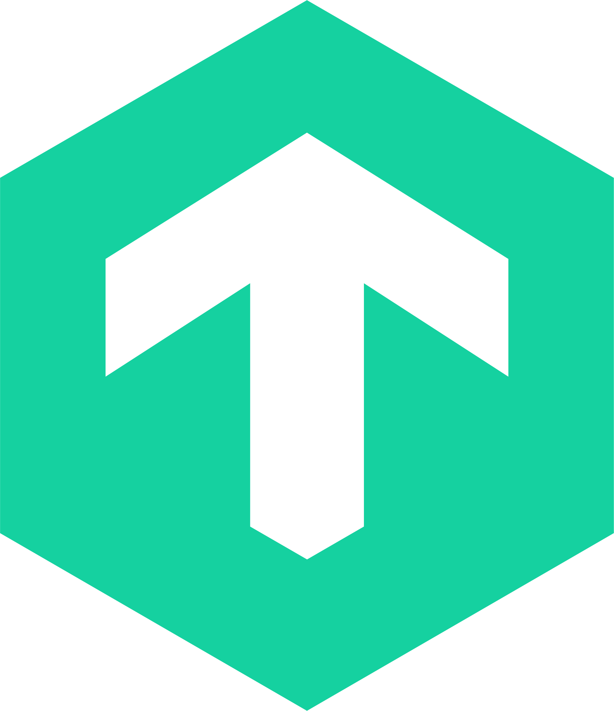<br/>
            Checkmk
        </a>
    </td>
    <td align="center" width="150">
        <a href="https://docs.keephq.dev/providers/documentation/cilium-provider" target="_blank">
            <br/>
            Cilium
        </a>
    </td>
</tr>
<tr>
    <td align="center" width="150">
        <a href="https://docs.keephq.dev/providers/documentation/checkly-provider" target="_blank">
            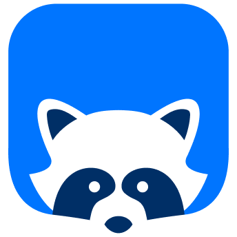<br/>
            Checkly
        </a>
    </td>
    <td align="center" width="150">
        <a href="https://docs.keephq.dev/providers/documentation/cloudwatch-provider" target="_blank">
            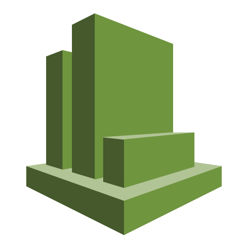<br/>
            CloudWatch
        </a>
    </td>
    <td align="center" width="150">
        <a href="https://docs.keephq.dev/providers/documentation/coralogix-provider" target="_blank">
            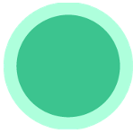<br/>
            Coralogix
        </a>
    </td>
    <td align="center" width="150">
        <a href="https://docs.keephq.dev/providers/documentation/dash0-provider" target="_blank">
            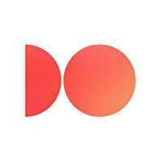<br/>
            Dash0
        </a>
    </td>
    <td align="center" width="150">
        <a href="https://docs.keephq.dev/providers/documentation/datadog-provider" target="_blank">
            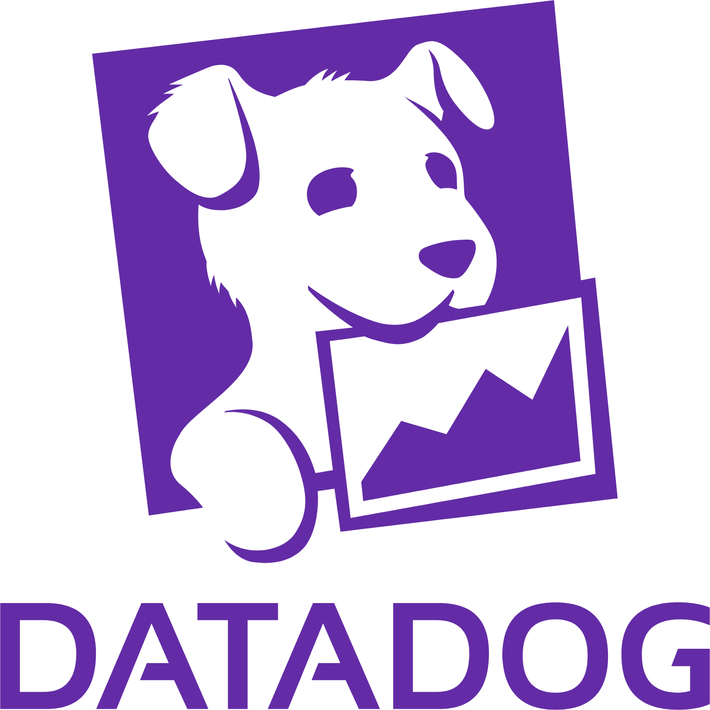<br/>
            Datadog
        </a>
    </td>
    <td align="center" width="150">
        <a href="https://docs.keephq.dev/providers/documentation/dynatrace-provider" target="_blank">
            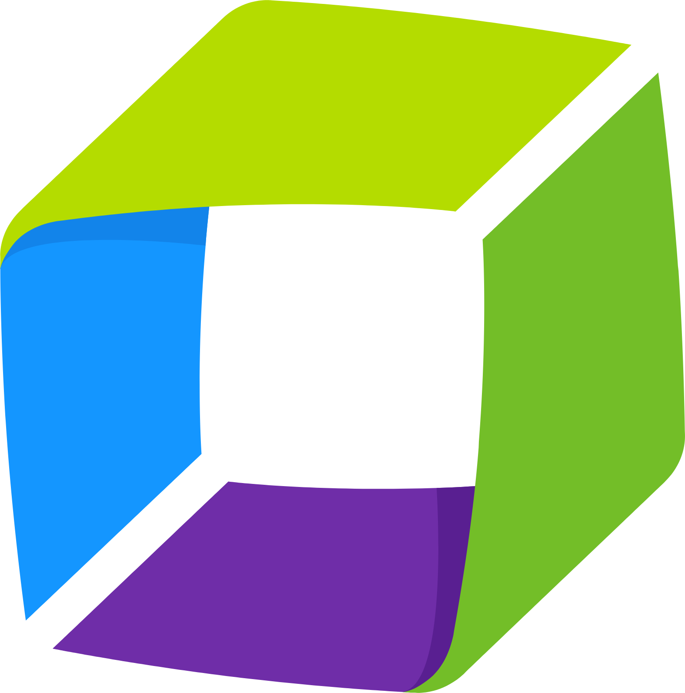<br/>
            Dynatrace
        </a>
    </td>
  </tr>
  <tr>
    <td align="center">
        <a href="https://docs.keephq.dev/providers/documentation/elastic-provider" target="_blank">
            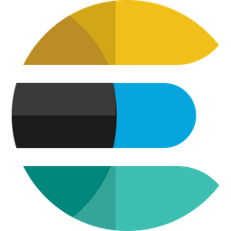<br/>
            Elastic
        </a>
    </td>
    <td align="center">
        <a href="https://docs.keephq.dev/providers/documentation/gcpmonitoring-provider" target="_blank">
            <br/>
            GCP Monitoring
        </a>
    </td>
    <td align="center" width="150">
        <a href="https://docs.keephq.dev/providers/documentation/grafana-provider" target="_blank">
            <br/>
            Grafana
        </a>
    </td>
    <td align="center" width="150">
        <a href="https://docs.keephq.dev/providers/documentation/grafana_loki-provider" target="_blank">
            <br/>
            Grafana Loki
        </a>
    </td>
    <td align="center" width="150">
        <a href="https://docs.keephq.dev/providers/documentation/graylog-provider" target="_blank">
            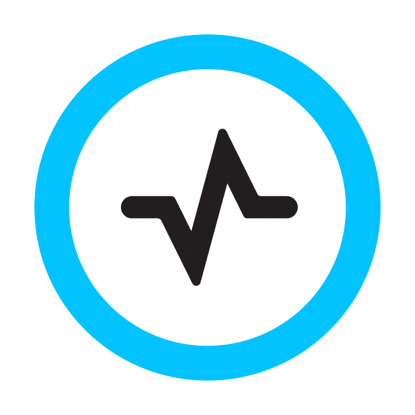<br/>
            Graylog
        </a>
    </td>
    <td align="center" width="150">
    <a href="https://docs.keephq.dev/providers/documentation/icinga2-provider" target="_blank">
        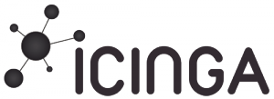
        <br/>
        Icinga2
    </a>
    </td>
  </tr>
  <tr>
    <td align="center" width="150">
        <a href="https://docs.keephq.dev/providers/documentation/kibana-provider" target="_blank">
            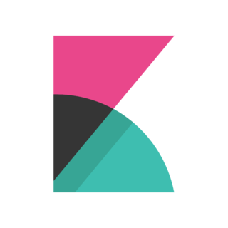<br/>
            Kibana
        </a>
    </td>
    <td align="center" width="150">
        <a href="https://docs.keephq.dev/providers/documentation/libre_nms-provider" target="_blank">
            <br/>
            LibreNMS
        </a>
    </td>
    <td align="center" width="150">
        <a href="https://docs.keephq.dev/providers/documentation/netbox-provider" target="_blank">
            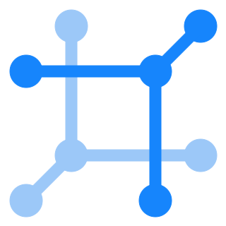<br/>
            NetBox
        </a>
    </td>
    <td align="center" width="150">
        <a href="https://docs.keephq.dev/providers/documentation/netdata-provider" target="_blank">
            <br/>
            Netdata
        </a>
    </td>
    <td align="center" width="150">
        <a href="https://docs.keephq.dev/providers/documentation/new-relic-provider" target="_blank">
            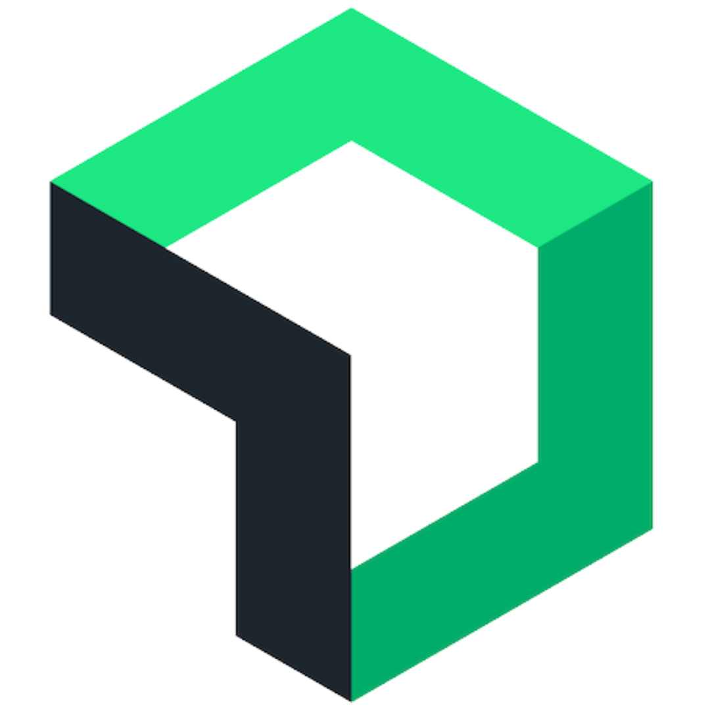<br/>
            New Relic
        </a>
    </td>
    <td align="center" width="150">
        <a href="https://docs.keephq.dev/providers/documentation/opensearchserverless-provider" target="_blank">
            <br/>
            OpenSearch Serverless
        </a>
    </td>

</tr>
<tr>
    <td align="center" width="150">
        <a href="https://docs.keephq.dev/providers/documentation/parseable-provider" target="_blank">
            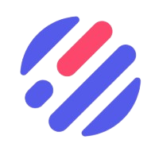<br/>
            Parseable
        </a>
    </td>
    <td align="center" width="150">
        <a href="https://docs.keephq.dev/providers/documentation/pingdom-provider" target="_blank">
            <br/>
            Pingdom
        </a>
    </td>
    <td align="center" width="150">
        <a href="https://docs.keephq.dev/providers/documentation/prometheus-provider" target="_blank">
            <br/>
            Prometheus
        </a>
    </td>
    <td align="center" width="150">
        <a href="https://docs.keephq.dev/providers/documentation/rollbar-provider" target="_blank">
            <br/>
            Rollbar
        </a>
    </td>
    <td align="center" width="150">
        <a href="https://docs.keephq.dev/providers/documentation/sentry-provider" target="_blank">
            <br/>
            Sentry
        </a>
    </td>
    <td align="center" width="150">
        <a href="https://docs.keephq.dev/providers/documentation/signalfx-provider" target="_blank">
            <br/>
            SignalFX
        </a>
    </td>

</tr>
<tr>
    <td align="center" width="150">
        <a href="https://docs.keephq.dev/providers/documentation/openobserve-provider" target="_blank">
            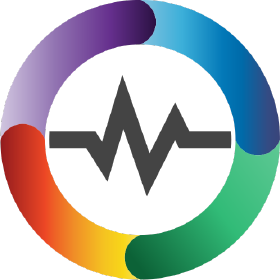<br/>
            OpenObserve
        </a>
    </td>
    <td align="center" width="150">
        <a href="https://docs.keephq.dev/providers/documentation/site24x7-provider" target="_blank">
            <br/>
          Site24x7
        </a>
  </td>
  <td align="center" width="150">
        <a href="https://docs.keephq.dev/providers/documentation/splunk-provider" target="_blank">
            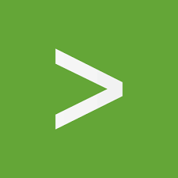<br/>
          Splunk
        </a>
  </td>
  <td align="center" width="150">
        <a href="https://docs.keephq.dev/providers/documentation/statuscake-provider" target="_blank">
            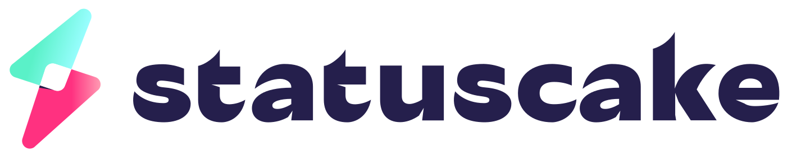<br/>
          StatusCake
        </a>
  </td>
  <td align="center" width="150">
        <a href="https://docs.keephq.dev/providers/documentation/sumologic-provider" target="_blank">
            <br/>
          SumoLogic
        </a>
  </td>
  <td align="center" width="150">
        <a href="https://docs.keephq.dev/providers/documentation/thousandeyes-provider" target="_blank">
            <br/>
          ThousandEyes
        </a>
  </td>

</tr>
<tr>
    <td align="center" width="150">
        <a href="https://docs.keephq.dev/providers/documentation/uptimekuma-provider" target="_blank">
            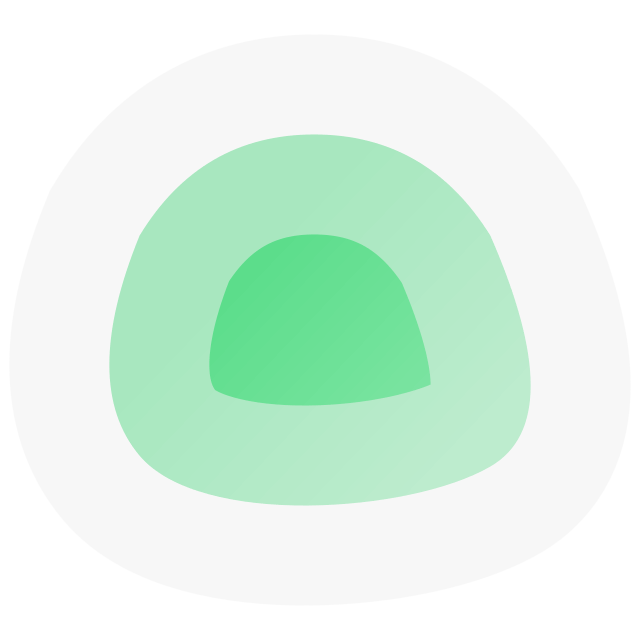<br/>
          UptimeKuma
        </a>
  </td>
    <td align="center" width="150">
        <a href="https://docs.keephq.dev/providers/documentation/victorialogs-provider" target="_blank">
            <br/>
          VictoriaLogs
        </a>
  </td>
    <td align="center" width="150">
        <a href="https://docs.keephq.dev/providers/documentation/victoriametrics-provider" target="_blank">
            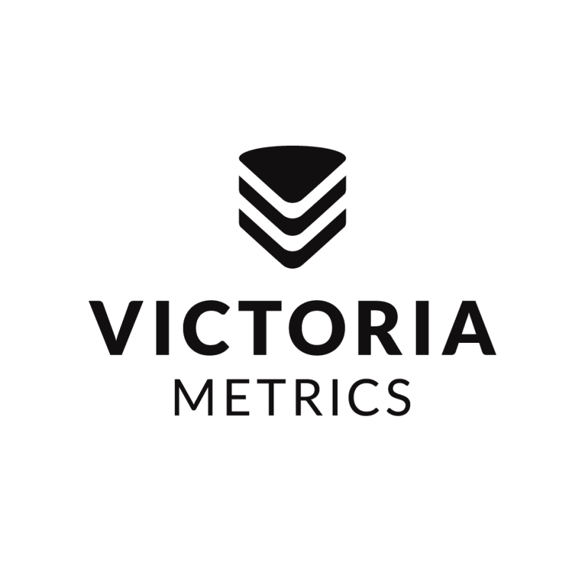<br/>
          VictoriaMetrics
        </a>
  </td>
  <td align="center" width="150">
        <a href="https://docs.keephq.dev/providers/documentation/wazuh-provider" target="_blank">
            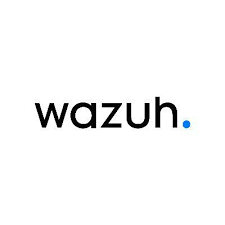<br/>
          Wazuh
        </a>
  </td>
  <td align="center" width="150">
        <a href="https://docs.keephq.dev/providers/documentation/zabbix-provider" target="_blank">
            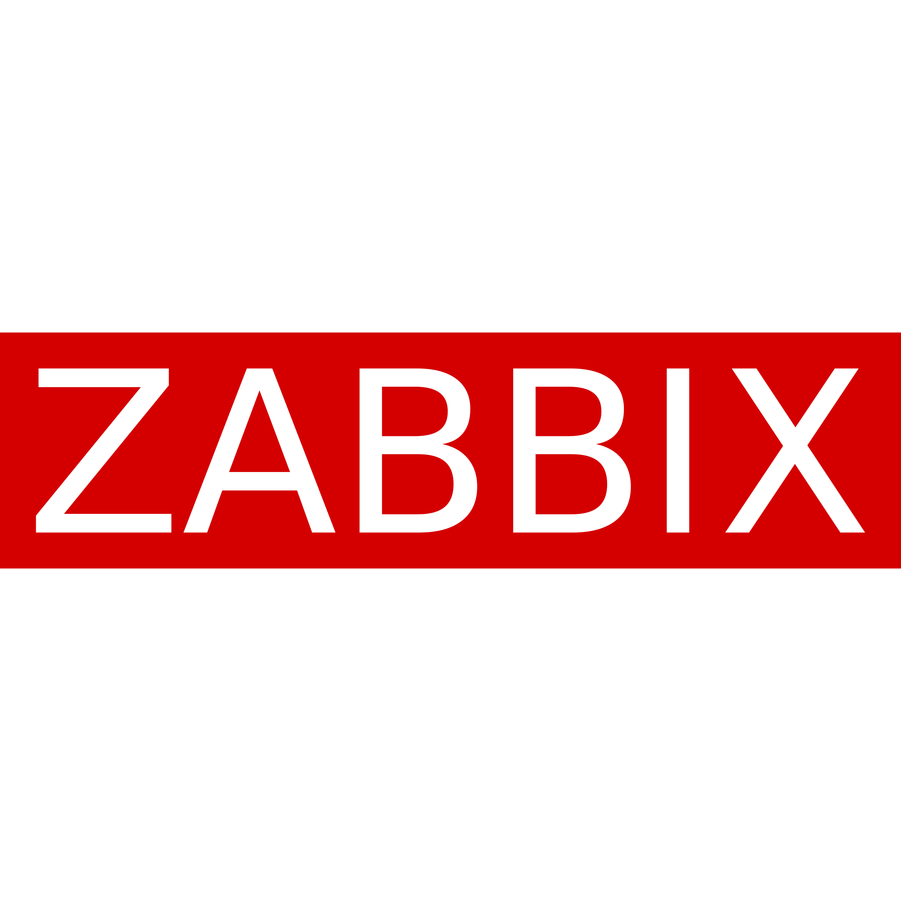<br/>
          Zabbix
        </a>
  </td>
</tr>
</table>

### 数据库与数据仓库

<table>
<tr>
    <td align="center" width="150">
        <a href="https://docs.keephq.dev/providers/documentation/bigquery-provider" target="_blank">
            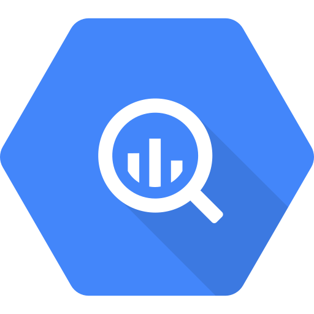<br/>
            BigQuery
        </a>
    </td>
    <td align="center" width="150">
        <a href="https://docs.keephq.dev/providers/documentation/clickhouse-provider" target="_blank">
            <br/>
            ClickHouse
        </a>
    </td>
    <td align="center" width="150">
        <a href="https://docs.keephq.dev/providers/documentation/databend-provider" target="_blank">
            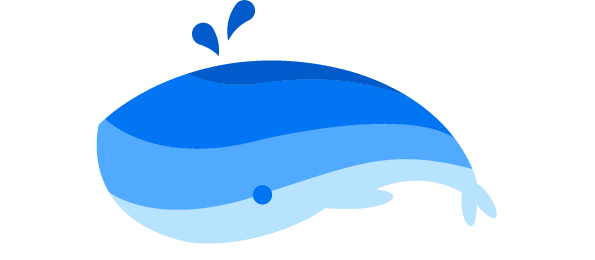<br/>
            Databend
        </a>
    </td>
    <td align="center" width="150">
        <a href="https://docs.keephq.dev/providers/documentation/mongodb-provider" target="_blank">
            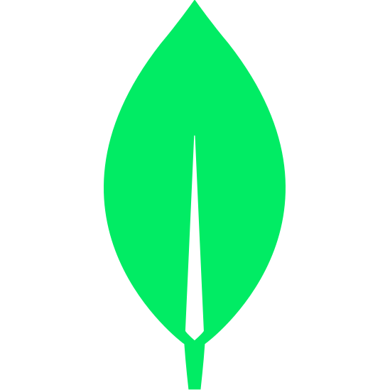<br/>
            MongoDB
        </a>
    </td>
    <td align="center" width="150">
        <a href="https://docs.keephq.dev/providers/documentation/mysql-provider" target="_blank">
            <br/>
            MySQL
        </a>
    </td>
    <td align="center" width="150">
        <a href="https://docs.keephq.dev/providers/documentation/postgres-provider" target="_blank">
            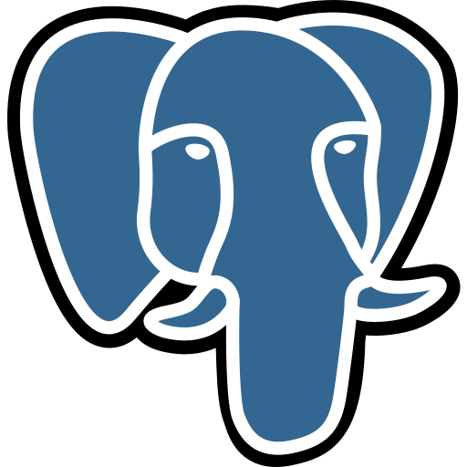<br/>
            PostgreSQL
        </a>
    </td>
</tr>
<tr>
    <td align="center" width="150">
        <a href="https://docs.keephq.dev/providers/documentation/snowflake-provider" target="_blank">
            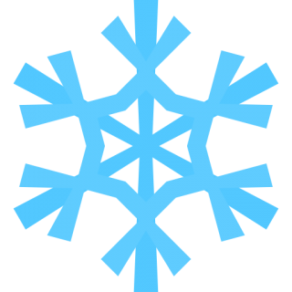<br/>
            Snowflake
        </a>
    </td>
</tr>
</table>

### 通信平台

<table>
<tr>
    <td align="center" width="150">
        <a href="https://docs.keephq.dev/providers/documentation/discord" target="_blank">
            <br/>
            Discord
        </a>
    </td>
    <td align="center" width="150">
        <a href="https://docs.keephq.dev/providers/documentation/google_chat-provider" target="_blank">
            <br/>
            Google Chat
        </a>
    </td>
    <td align="center" width="150">
        <a href="https://docs.keephq.dev/providers/documentation/mailgun-provider" target="_blank">
            <br/>
            Mailgun
        </a>
    </td>
    <td align="center" width="150">
        <a href="https://docs.keephq.dev/providers/documentation/mattermost-provider" target="_blank">
            <br/>
            Mattermost
        </a>
    </td>
    <td align="center" width="150">
        <a href="https://docs.keephq.dev/providers/documentation/ntfy-provider" target="_blank">
            <br/>
            Ntfy.sh
        </a>
    </td>
  <td align="center" width="150">
        <a href="https://docs.keephq.dev/providers/documentation/pushover-provider" target="_blank">
            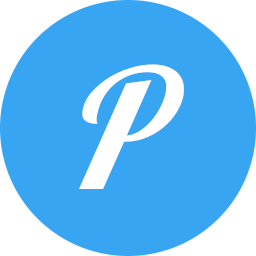<br/>
            Pushover
        </a>
  </td>
  <td align="center" width="150">
        <a href="https://docs.keephq.dev/providers/documentation/resend-provider" target="_blank">
            <br/>
            Resend
        </a>
  </td>
</tr>
<tr>
  <td align="center" width="150">
      <a href="https://docs.keephq.dev/providers/documentation/sendgrid-provider" target="_blank">
          <br/>
          SendGrid
      </a>
  </td>
  <td align="center" width="150">
      <a href="https://docs.keephq.dev/providers/documentation/slack-provider" target="_blank">
          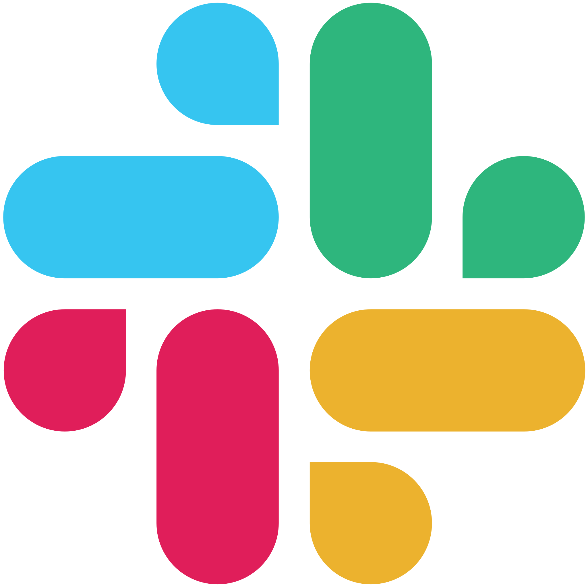<br/>
          Slack
      </a>
  </td>
  <td align="center" width="150">
      <a href="https://docs.keephq.dev/providers/documentation/smtp-provider" target="_blank">
          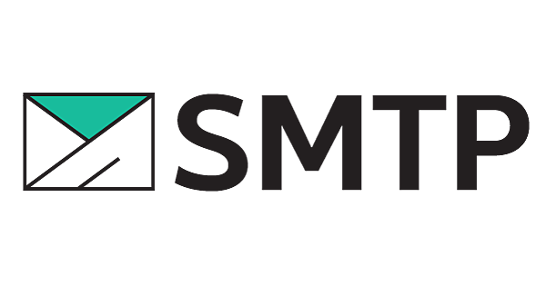<br/>
          SMTP
      </a>
  </td>
  <td align="center" width="150">
      <a href="https://docs.keephq.dev/providers/documentation/telegram-provider" target="_blank">
          <br/>
          Telegram
      </a>
  </td>
  <td align="center" width="150">
      <a href="https://docs.keephq.dev/providers/documentation/twilio-provider" target="_blank">
          <br/>
          Twilio
      </a>
  </td>
  <td align="center" width="150">
      <a href="https://docs.keephq.dev/providers/documentation/teams-provider" target="_blank">
          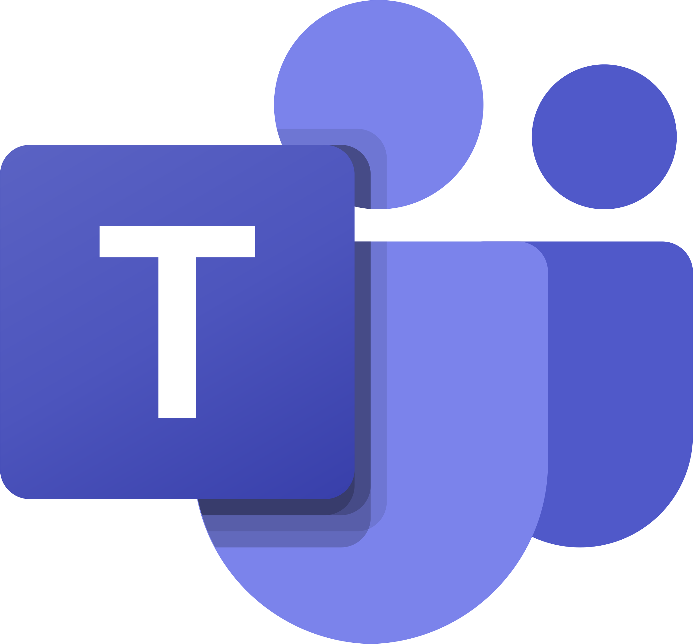<br/>
          Teams
      </a>
  </td>
  <td align="center" width="150">
      <a href="https://docs.keephq.dev/providers/documentation/zoom-provider" target="_blank">
          <br/>
          Zoom
      </a>
  </td>
</tr>
<tr>
  <td align="center" width="150">
      <a href="https://docs.keephq.dev/providers/documentation/zoom_chat-provider" target="_blank">
          <br/>
          Zoom Chat
      </a>
  </td>
</tr>
</table>

### 事件管理

<table>
  <tr>
      <td align="center" width="150">
          <a href="https://docs.keephq.dev/providers/documentation/grafana_incident-provider" target="_blank">
              <br/>
              Grafana Incident
          </a>
      </td>
      <td align="center" width="150">
          <a href="https://docs.keephq.dev/providers/documentation/grafana_oncall-provider" target="_blank">
              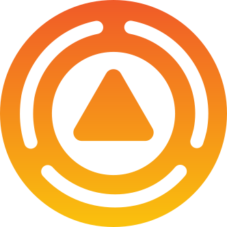<br/>
              Grafana OnCall
          </a>
      </td>
      <td align="center" width="150">
          <a href="https://docs.keephq.dev/providers/documentation/ilert-provider" target="_blank">
              <br/>
              Ilert
          </a>
      </td>
      <td align="center" width="150">
          <a href="https://docs.keephq.dev/providers/documentation/incidentio-provider" target="_blank">
              <br/>
              Incident.io
          </a>
      </td>
      <td align="center" width="150">
          <a href="https://docs.keephq.dev/providers/documentation/incidentmanager-provider" target="_blank">
              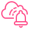<br/>
              AWS Incident Manager
          </a>
      </td>
      <td align="center" width="150">
          <a href="https://docs.keephq.dev/providers/documentation/opsgenie-provider" target="_blank">
              <br/>
              OpsGenie
          </a>
      </td>
  </tr>
    <tr>
      <td align="center" width="150">
          <a href="https://docs.keephq.dev/providers/documentation/pagerduty-provider" target="_blank">
              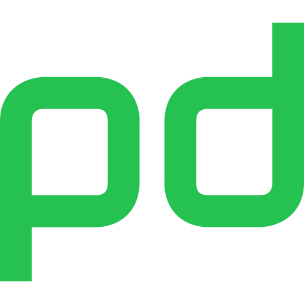<br/>
              PagerDuty
          </a>
      </td>
      <td align="center" width="150">
          <a href="https://docs.keephq.dev/providers/documentation/pagertree-provider" target="_blank">
              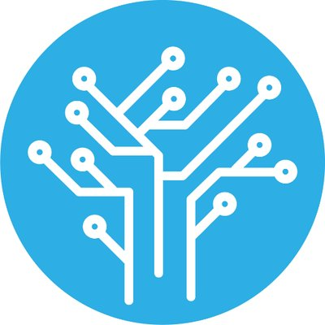<br/>
              Pagertree
          </a>
      </td>
      <td align="center" width="150">
          <a href="https://docs.keephq.dev/providers/documentation/signl4-provider" target="_blank">
              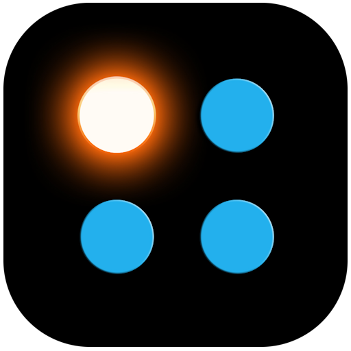<br/>
              SINGL4
          </a>
      </td>
      <td align="center" width="150">
          <a href="https://docs.keephq.dev/providers/documentation/squadcast-provider" target="_blank">
              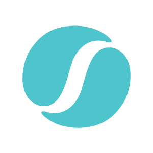<br/>
              Squadcast
          </a>
      </td>
      <td align="center" width="150">
          <a href="https://docs.keephq.dev/providers/documentation/zenduty-provider" target="_blank">
              <br/>
              Zenduty
          </a>
      </td>
      <td align="center" width="150">
          <a href="https://docs.keephq.dev/providers/documentation/flashduty-provider" target="_blank">
              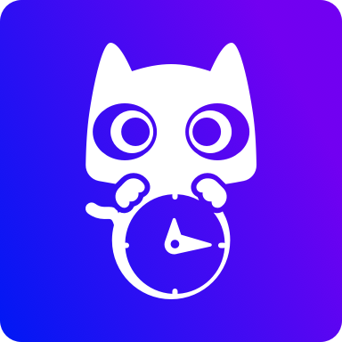<br/>
              Flashduty
          </a>
      </td>
  </tr>
</table>

### 工单工具

<table>
<tr>
    <td align="center" width="150">
        <a href="https://docs.keephq.dev/providers/documentation/asana-provider" target="_blank">
            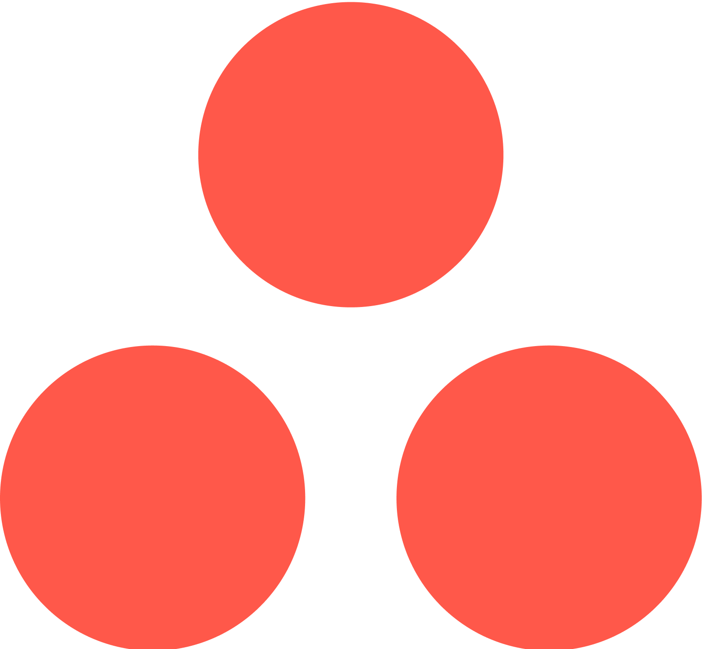<br/>
            Asana
        </a>
    </td>
    <td align="center" width="150">
        <a href="https://docs.keephq.dev/providers/documentation/github-provider" target="_blank">
            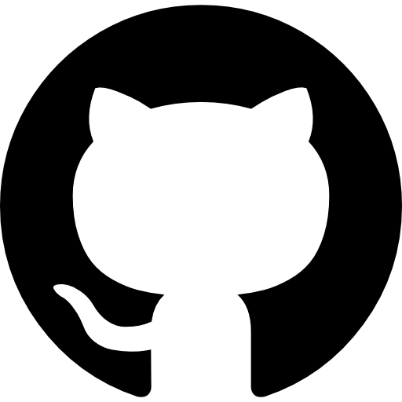<br/>
            GitHub
        </a>
    </td>
    <td align="center" width="150">
        <a href="https://docs.keephq.dev/providers/documentation/gitlab-provider" target="_blank">
            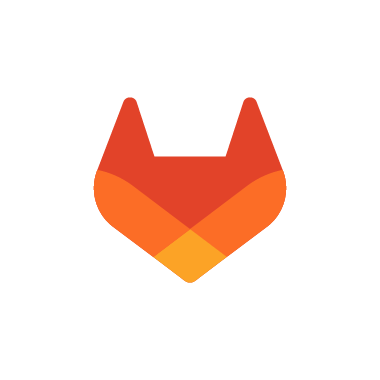<br/>
            GitLab
        </a>
    </td>
    <td align="center" width="150">
        <a href="https://docs.keephq.dev/providers/documentation/jira-provider" target="_blank">
            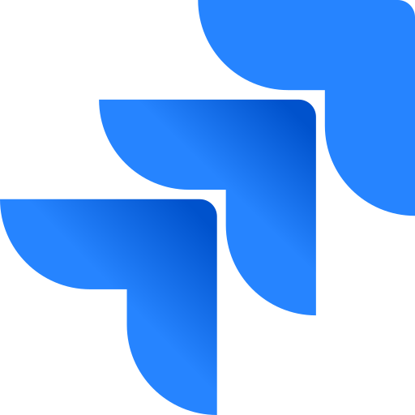<br/>
            Jira
        </a>
    </td>
    <td align="center" width="150">
        <a href="https://docs.keephq.dev/providers/documentation/linear_provider" target="_blank">
            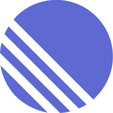<br/>
            Linear
        </a>
    </td>
    <td align="center" width="150">
        <a href="https://docs.keephq.dev/providers/documentation/linearb-provider" target="_blank">
            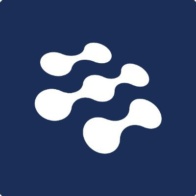<br/>
            LinearB
        </a>
    </td>
    <td align="center" width="150">
        <a href="https://docs.keephq.dev/providers/documentation/microsoft-planner-provider" target="_blank">
            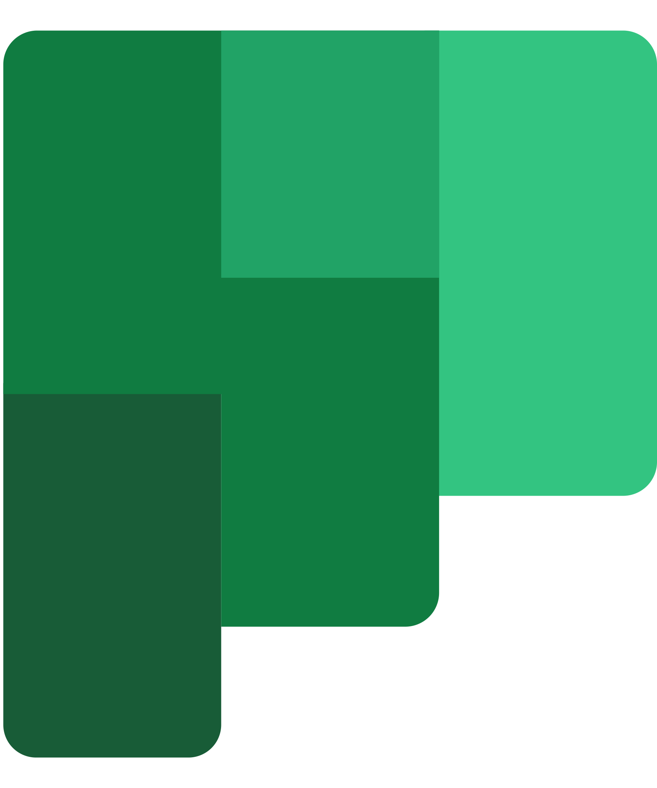<br/>
            Microsoft Planner
        </a>
    </td>
</tr>
<tr>
    <td align="center" width="150">
        <a href="https://docs.keephq.dev/providers/documentation/monday-provider" target="_blank">
            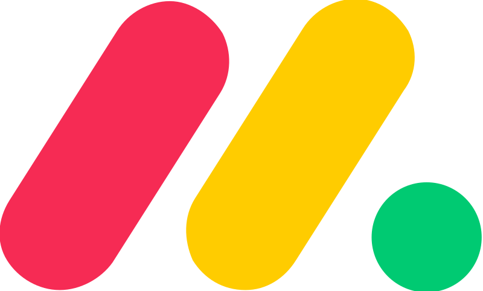<br/>
            Monday
        </a>
    </td>
  <td align="center" width="150">
        <a href="https://docs.keephq.dev/providers/documentation/redmine-provider" target="_blank">
            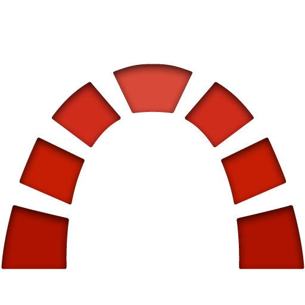<br/>
            Redmine
        </a>
  </td>
  <td align="center" width="150">
      <a href="https://docs.keephq.dev/providers/documentation/service-now-provider" target="_blank">
          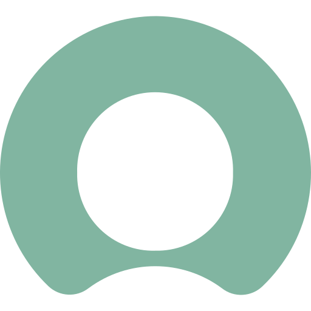<br/>
          ServiceNow
      </a>
  </td>
  <td align="center" width="150">
      <a href="https://docs.keephq.dev/providers/documentation/trello-provider" target="_blank">
          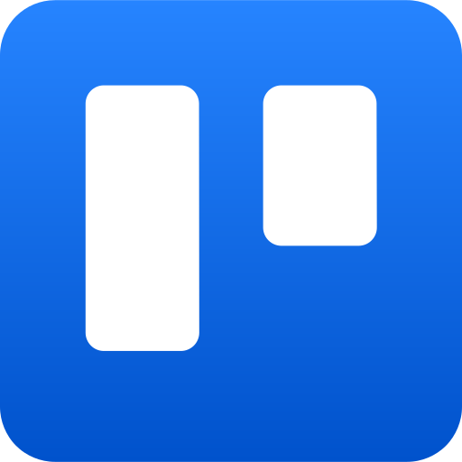<br/>
          Trello
      </a>
  </td>
  <td align="center" width="150">
      <a href="https://docs.keephq.dev/providers/documentation/youtrack-provider" target="_blank">
          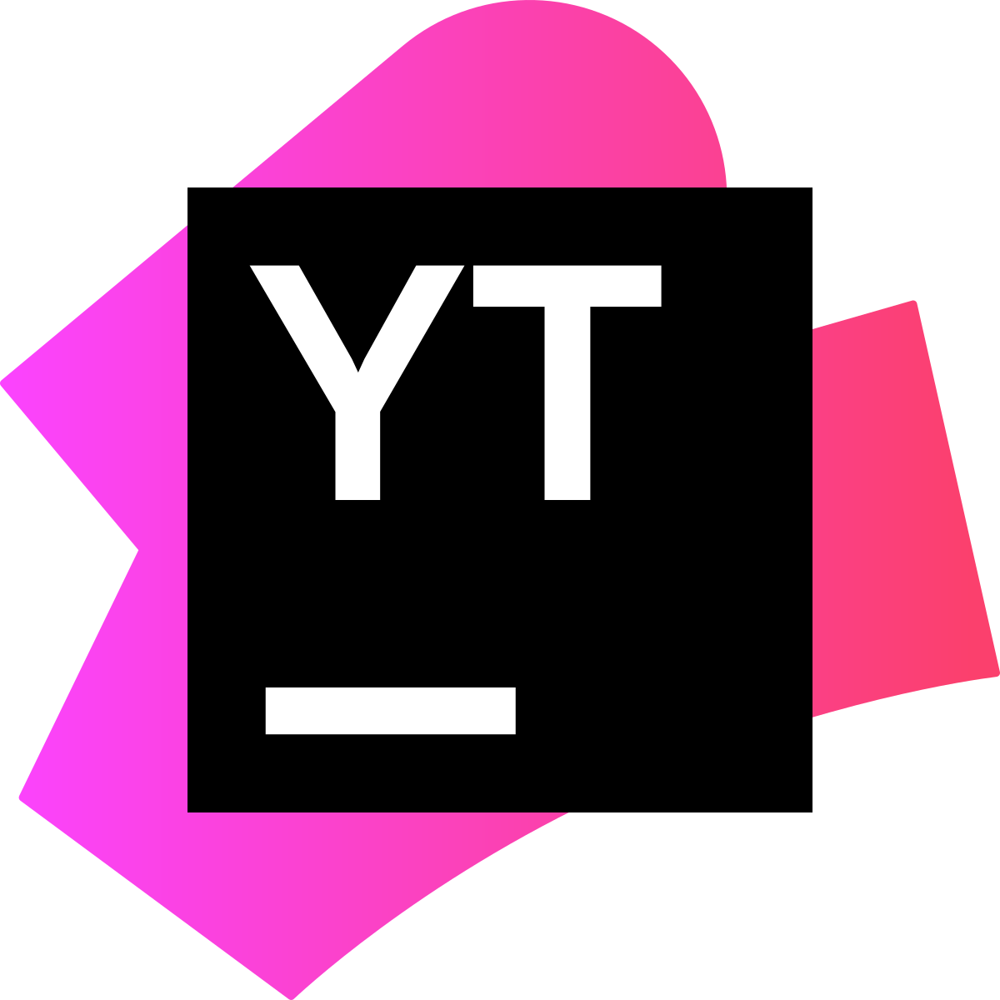<br/>
          YouTrack
      </a>
  </td>
</tr>
</table>

### 容器编排平台

<table>
<tr>
    <td align="center" width="150">
        <a href="https://docs.keephq.dev/providers/documentation/aks-provider" target="_blank">
            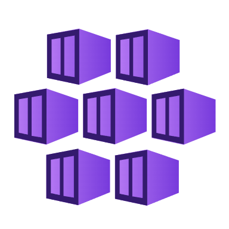<br/>
            Azure AKS
        </a>
    </td>
    <td align="center" width="150">
        <a href="https://docs.keephq.dev/providers/documentation/argocd-provider" target="_blank">
            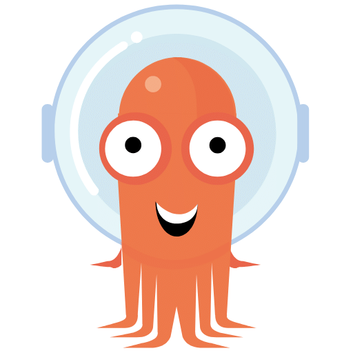<br/>
            ArgoCD
        </a>
    </td>
    <td align="center" width="150">
        <a href="https://docs.keephq.dev/providers/documentation/fluxcd-provider" target="_blank">
            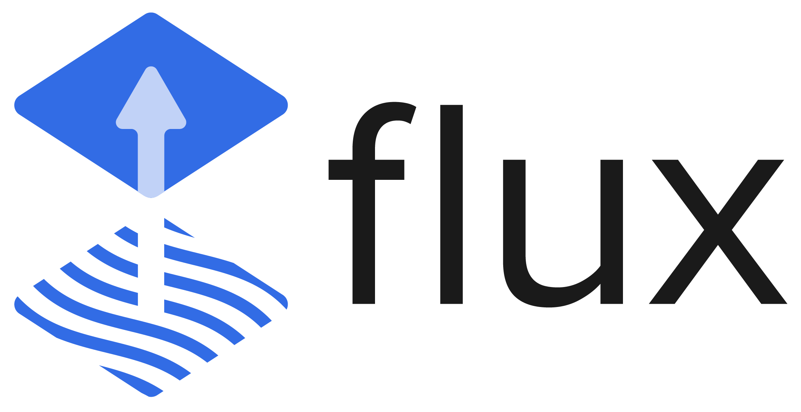<br/>
            Flux
        </a>
    </td>
    <td align="center" width="150">
        <a href="https://docs.keephq.dev/providers/documentation/gke-provider" target="_blank">
            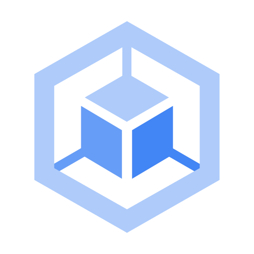<br/>
            GKE
        </a>
    </td>
    <td align="center" width="150">
        <a href="https://docs.keephq.dev/providers/documentation/kubernetes-provider" target="_blank">
            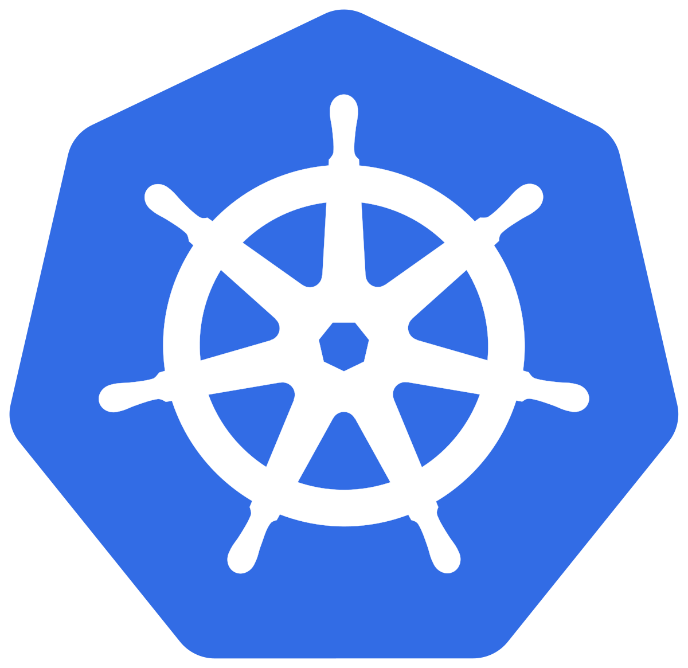<br/>
            Kubernetes
        </a>
    </td>
    <td align="center" width="150">
        <a href="https://docs.keephq.dev/providers/documentation/openshift-provider" target="_blank">
            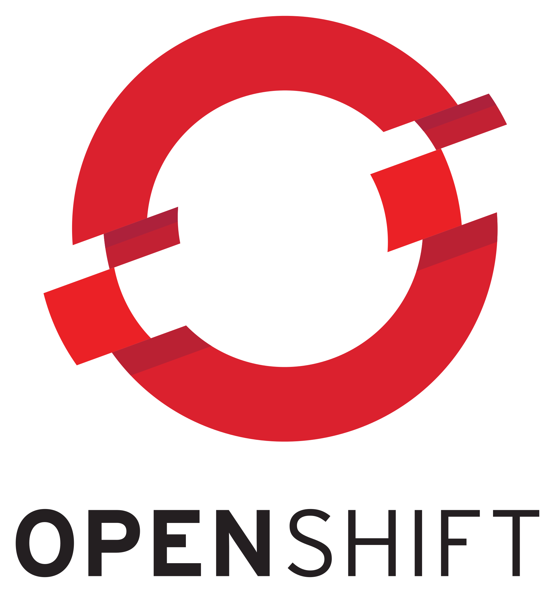<br/>
            OpenShift
        </a>
    </td>
</tr>
</table>

### 数据丰富

<table>
<tr>
<td align="center" width="150">
        <a href="https://docs.keephq.dev/providers/documentation/bash-provider" target="_blank">
            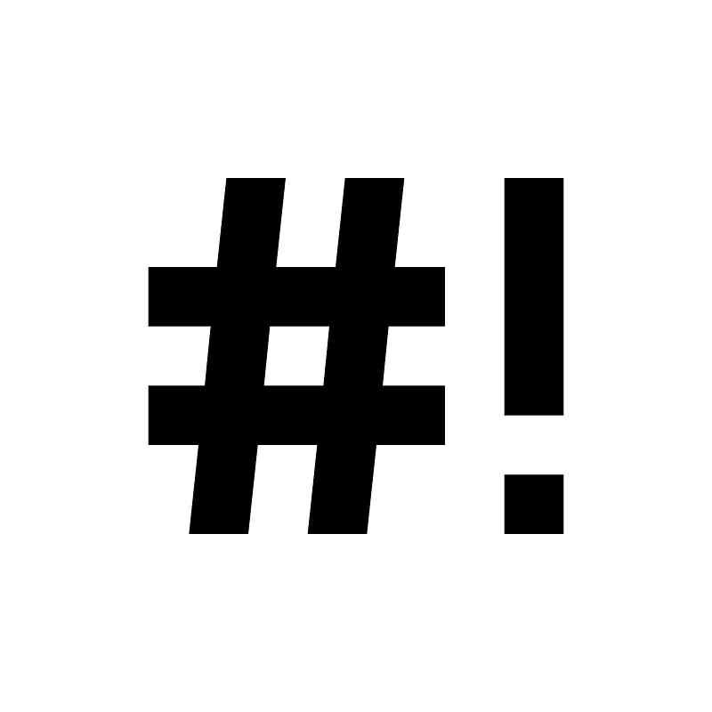<br/>
            Bash
        </a>
    </td>
    <td align="center" width="150">
        <a href="https://docs.keephq.dev/providers/documentation/openai-provider" target="_blank">
            <br/>
            OpenAI
        </a>
    </td>
    <td align="center" width="150">
        <a href="https://docs.keephq.dev/providers/documentation/python-provider" target="_blank">
            <br/>
            Python
        </a>
    </td>
    <td align="center" width="150">
        <a href="https://docs.keephq.dev/providers/documentation/quickchart-provider" target="_blank">
            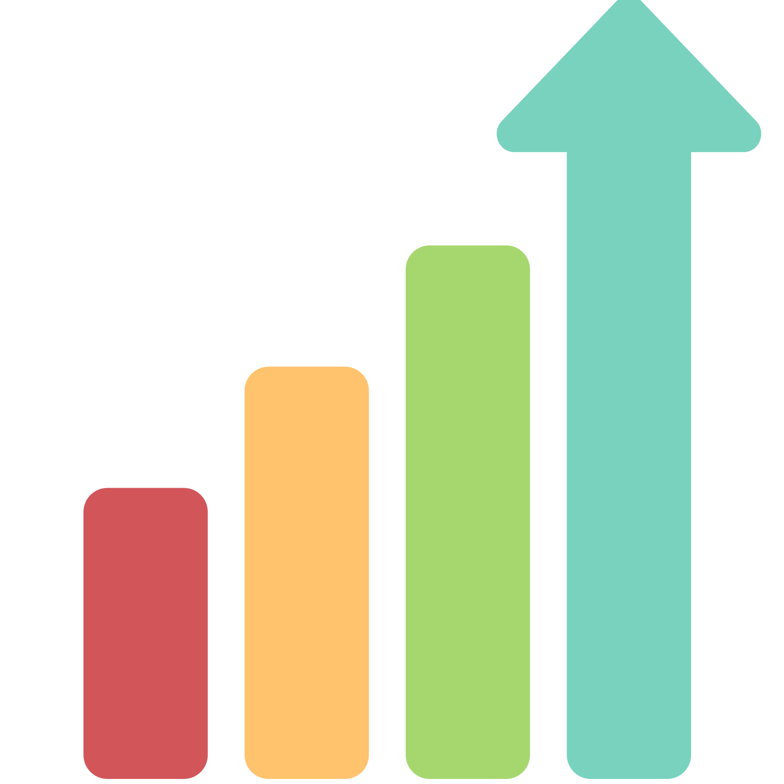<br/>
            QuickChart
        </a>
    </td>
    <td align="center" width="150">
        <a href="https://docs.keephq.dev/providers/documentation/ssh-provider" target="_blank">
            <br/>
            SSH
        </a>
    </td>
    <td align="center" width="150">
        <a href="https://docs.keephq.dev/providers/documentation/webhook-provider" target="_blank">
            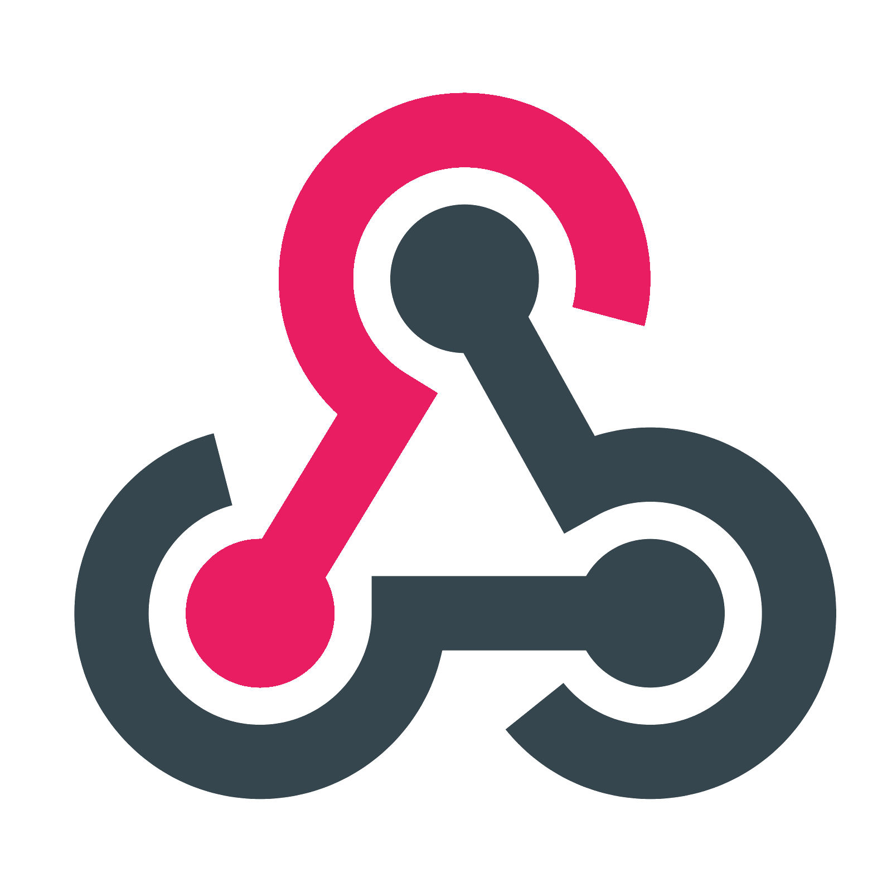<br/>
            Webhook
        </a>
    </td>
</tr>
</table>

### 工作流编排

<table>
<tr>
    <td align="center" width="150">
        <a href="https://docs.keephq.dev/providers/documentation/airflow-provider" target="_blank">
            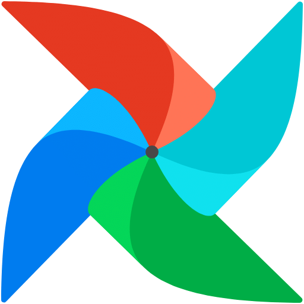<br/>
            Airflow
        </a>
    </td>
</tr>
</table>

### 队列

<table>
<tr>
    <td align="center" width="150">
        <a href="https://docs.keephq.dev/providers/documentation/amazonsqs-provider" target="_blank">
            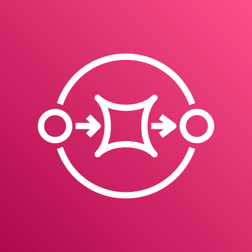<br/>
            Amazon SQS
        </a>
    </td>
    <td align="center" width="150">
        <a href="https://docs.keephq.dev/providers/documentation/kafka-provider" target="_blank">
            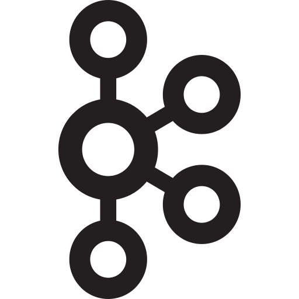<br/>
            Kafka
        </a>
    </td>
</tr>
</table>

## 工作流

Keep 是为你的监控工具提供的 GitHub Actions。

Keep 工作流是一个声明式的 YAML 文件，自动化你的告警与事件管理。每个工作流包含：

- **触发器** - 启动工作流的事件（告警、事件、计划或手动）
- **步骤** - 读取或拉取数据（丰富、上下文）
- **操作** - 执行动作（更新工单、发送通知、重启服务器）

下面是一个简单的工作流，在 `payments` 与 `api` 服务中为每个来自 `sentry` 的 `critical` 告警创建 Jira 工单。

更多工作流请见 [此处](https://github.com/keephq/keep/tree/main/examples/workflows)。

```yaml
workflow:
  id: sentry-alerts
  description: create ticket alerts for critical alerts from sentry
  triggers:
    - type: alert
      # customize the filter to run only on critical alert from sentry
      filters:
        - key: source
          value: sentry
        - key: severity
          value: critical
        # regex to match specific services
        - key: service
          value: r"(payments|ftp)"
  actions:
    - name: send-slack-message-team-payments
      # if the alert is on the payments service, slack the payments team
      if: "'{{ alert.service }}' == 'payments'"
      provider:
        type: slack
        # control which Slack configuration you want to use
        config: " {{ providers.team-payments-slack }} "
        # customize the alert message with context from {{ alert }} or any other {{ step }}
        with:
          message: |
            "A new alert from Sentry: Alert: {{ alert.name }} - {{ alert.description }}
            {{ alert}}"
    - name: create-jira-ticket-oncall-board
      # control the workflow flow with "if" and "foreach" statements
      if: "'{{ alert.service }}' == 'ftp' and not '{{ alert.ticket_id }}'"
      provider:
        type: jira
        config: " {{ providers.jira }} "
        with:
          board_name: "Oncall Board"
          custom_fields:
            customfield_10201: "Critical"
          issuetype: "Task"
          # customize the summary
          summary: "{{ alert.name }} - {{ alert.description }} (created by Keep)"
          description: |
            "This ticket was created by Keep.
            Please check the alert details below:
            {code:json} {{ alert }} {code}"
          # enrich the alerts with more context. from now on, the alert will be assigned with the ticket id, type and url
          enrich_alert:
            - key: ticket_type
              value: jira
            - key: ticket_id
              value: results.issue.key
            - key: ticket_url
              value: results.ticket_url
```

## 企业就绪

- **以开发者为先** - 现代 REST API、原生 SDK 与全面的文档，实现无缝集成
- **[企业安全](https://docs.keephq.dev/deployment/authentication/overview)** - 完整认证支持（SSO、SAML、OIDC、LDAP），配合细粒度访问控制（RBAC、ABAC）与团队管理
- **灵活部署** - 可在本地或隔离环境中部署，架构与云无关
- **[生产级规模](https://docs.keephq.dev/deployment/stress-testing)** - 支持横向扩展的高可用、性能验证基础设施

## 入门指南

> 需要帮助？找不到你的环境配置？在 Slack 上联系我们，我们会及时协助。

Keep 可在多种环境与配置中运行。最简单的启动方式是使用 Keep 的 Docker Compose。

- 在 [本地](https://docs.keephq.dev/development/getting-started) 运行 Keep。
- 在 [Kubernetes](https://docs.keephq.dev/deployment/kubernetes/installation) 上运行 Keep。
- 使用 [Docker](https://docs.keephq.dev/deployment/docker) 运行 Keep。
- 在 [AWS ECS](https://docs.keephq.dev/deployment/ecs) 上运行 Keep。
- 在 [OpenShift](https://docs.keephq.dev/deployment/kubernetes/openshift) 上运行 Keep。

## 🫵 Keepers

### 主要贡献者

特别感谢那些帮助 Keep 变得更优秀的核心贡献者，你们远不止“很棒”这几个字。

- [Furkan](https://github.com/pehlicd)
- [Asharon](https://github.com/asharonbaltazar)

想成为顶级贡献者？加入我们的 Slack，私信 Tal、Shahar 或 Furkan。

### 贡献者

感谢你的贡献与坚持，让 <b>Keep</b> 持续进化，<b>你真的很强</b> 🫶

<a href="https://github.com/keephq/keep/graphs/contributors">
  
</a>
